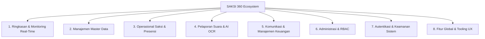

# KNOWLEDGE BASE & SPESIFIKASI SISTEM SAKSI 360
> **Dokumen Referensi Resmi untuk NotebookLM, LLM Context, dan Dokumentasi Teknis Sistem**  
> *Versi Dokumen: 1.0.0 | Terakhir Diperbarui: 2026-08-20*

---

## 1. IKHTISAR SISTEM (SYSTEM OVERVIEW)

### 1.1 Apa Itu SAKSI 360?
**SAKSI 360** adalah platform terpadu pemantauan pemilu, manajemen saksi TPS (*Tempat Pemungutan Suara*), dan pengawalan suara (*real-count & quick-count*) berbasis multi-platform yang dirancang khusus untuk ekosistem Pemilihan Umum di Indonesia (Pilpres, Pileg DPR RI/DPRD, dan Pilkada).

Sistem ini terbagi menjadi dua pilar utama:
1. **SAKSI 360 Admin (Web Control Tower):** Dashboard web terpusat untuk pimpinan, pengurus wilayah (DPP/DPW/DPD/DPC/PAC), verifikator data, admin keuangan, dan operator command center.
2. **SAKSI 360 Mobile (Aplikasi Lapangan):** Aplikasi mobile (React Native / Expo) untuk Saksi TPS, Koordinator Lapangan (Korlap), dan Operator Lapangan dalam melakukan presensi GPS, scan OCR C-Hasil Plano, scan KTP, serta pelaporan kejadian darurat.

---

### 1.2 Tujuan & Nilai Strategis
- **Integritas Suara:** Meminimalisir manipulasi hasil perolehan suara dengan validasi silang antara foto C-Hasil Plano fisik, ekstraksi angka otomatis berbasis AI OCR, dan validasi konsistensi matematika (*Suara Sah + Suara Tidak Sah = Total Pengguna Hak Pilih*).
- **Presensi Valid & Anti-Saksi Fiktif:** Menerapkan verifikasi presensi berbasis **Geofencing GPS** radius titik TPS, verifikasi foto selfie lapangan, dan deteksi manipulasi lokasi (*anti-spoofing*).
- **Pengawasan Hirarkis Multi-Tingkat:** Monitoring terstruktur dari tingkat TPS (Kelurahan) hingga tingkat Nasional (38 Provinsi) secara berjenjang (*Least Privilege & Regional Scoping*).
- **Command Center & Respon Cepat Insiden:** Papan pantau langsung (*live feed*) kendala dan laporan insiden darurat lapangan dengan tingkat keparahan (*Low, Medium, High/Kritis*).
- **Simulasi Konversi Kursi Otomatis:** Perhitungan *Parliamentary Threshold* (4%) dan konversi perolehan kursi DPR RI menggunakan metode baku **Sainte-Laguë**.
- **Akuntabilitas Finansial & Administrasi:** Penerbitan Surat Mandat / Tugas Digital bersertifikasi QR Code serta transparansi pencairan honorarium saksi dengan generator invoice/slip transfer BCA.

---

## 2. ARSITEKTUR HIERARKI PERAN & RBAC (ROLE-BASED ACCESS CONTROL)

### 2.1 Klasifikasi 12 Peran Pengguna (User Roles)

```
[ SUPER ADMIN ]
   │
   ├── [ PIMPINAN ] ──────────── Dashboard Eksekutif & Ringkasan Strategis
   │
   ├── [ HIERARKI WILAYAH PARTAI ]
   │     ├── DPP (Nasional - 38 Provinsi)
   │     ├── DPW (Provinsi)
   │     ├── DPD (Kabupaten / Kota)
   │     ├── DPC (Kecamatan)
   │     └── PAC (Kelurahan / Ranting)
   │
   ├── [ FUNGSIONAL OPERASIONAL & KONTROL ]
   │     ├── Admin Pusat (Manajemen Master Data & Broadcast)
   │     ├── Verifikator (Validasi Hasil OCR C-Hasil & Koreksi Data)
   │     └── Admin Keuangan (Manajemen Anggaran & Verifikasi Honorarium)
   │
   └── [ OPERASIONAL LAPANGAN ]
         ├── Operator Lapangan (Supervisi & Registrasi Saksi Tingkat Kota)
         ├── Koordinator Lapangan (Korlap - Mengampu Kluster TPS Binaan)
         └── Saksi TPS (Petugas Garis Depan di 1 TPS Resmi)
```

#### Deskripsi & Cakupan Wilayah (Scope) Setiap Peran:

| No | Peran (Role) | Kode Role | Cakupan Teritori (Data Scope) | Tanggung Jawab Utama |
|---|---|---|---|---|
| 1 | **Super Admin** | `SUPER_ADMIN` | Seluruh Sistem (Global) | Kontrol penuh sistem, konfigurasi RBAC matrix dinamis, audit log, manajemen database. |
| 2 | **DPP (Pusat)** | `DPP` | Nasional (38 Provinsi) | Monitoring agregasi suara nasional, ranking provinsi, siaran pesan nasional, audit. |
| 3 | **DPW (Provinsi)** | `DPW` | 1 Provinsi (Seluruh Kab/Kota) | Supervisi teritori provinsi, approval pencairan dana wilayah, siaran instruksi provinsi. |
| 4 | **DPD (Kab/Kota)** | `DPD` | 1 Kabupaten/Kota (Seluruh Kec) | Monitoring TPS kabupaten/kota, pengawasan operator dan saksi se-kota. |
| 5 | **DPC (Kecamatan)**| `DPC` | 1 Kecamatan (Seluruh Kel/Desa) | Monitoring perolehan suara tingkat kecamatan, pengawasan saksi per kelurahan. |
| 6 | **PAC (Ranting)** | `PAC` | 1 Kelurahan / Desa | Monitoring TPS tingkat basis, koordinasi saksi lingkungan TPS lokal. |
| 7 | **Admin Pusat** | `ADMIN_PUSAT` | Nasional | Manajemen master data caleg, saksi, koordinator, penerbitan surat tugas resmi. |
| 8 | **Verifikator** | `VERIFIKATOR` | Multi-Wilayah | Verifikasi antrean dokumen C-Hasil OCR, koreksi nilai salah baca AI, approval form. |
| 9 | **Admin Keuangan**| `ADMIN_KEUANGAN` | Nasional / Teritori | Verifikasi pencairan honorarium saksi, kontrol KPI anggaran, cetak invoice transfer BCA. |
| 10 | **Pimpinan** | `PIMPINAN` | Nasional / Eksekutif | Dashboard KPI ringkas, monitoring paslon unggul, provinsi tertinggi/terendah. |
| 11 | **Koordinator Lap**| `TPS_COORDINATOR`| 1 Kluster (±6 TPS Binaan) | Supervisi kehadiran saksi binaan, pendampingan input C1, monitoring kendala TPS. |
| 12 | **Saksi TPS** | `TPS_WITNESS` | 1 TPS Khusus | Presensi GPS selfie, scan KTP, input formulir C-Hasil, lapor insiden darurat di TPS. |

---

### 2.2 Matriks Hak Akses RBAC (12 Peran × 19 Modul Fitur)

> **Keterangan Izin:**  
> - `CRUD` = Create, Read, Update, Delete (Akses Penuh)  
> - `CRU` = Create, Read, Update  
> - `R` = Read-Only (Melihat data sesuai batasan teritori)  
> - `C` = Create Only (Mengirim data/pesan)  
> - `-` = Tidak Memiliki Akses (Restricted / Tersembunyi)

| Modul / Fitur Sistem | Super Admin | DPP / Admin Pusat | DPW | DPD | DPC | PAC | Verifikator | Admin Keuangan | Pimpinan | Operator Lapangan | Koordinator Lapangan | Saksi TPS |
|---|:---:|:---:|:---:|:---:|:---:|:---:|:---:|:---:|:---:|:---:|:---:|:---:|
| **1. Dashboard Ringkasan** | `CRUD` | `R` (Nas) | `R` (Prov) | `R` (Kota) | `R` (Kec) | `R` (Desa) | `R` | `R` | `R` (Nas) | `R` (Kota) | `R` (Kluster) | `R` (TPS) |
| **2. Peta Interaktif GIS** | `CRUD` | `R` (Nas) | `R` (Prov) | `R` (Kota) | `R` (Kec) | `R` (Desa) | `R` | `R` | `R` (Nas) | `R` (Kota) | `R` (Kluster) | `-` |
| **3. Live Command Center** | `CRUD` | `R` (Nas) | `R` (Prov) | `R` (Kota) | `R` (Kec) | `R` (Desa) | `R` | `-` | `R` (Nas) | `R` (Kota) | `R` (Kluster) | `-` |
| **4. Dashboard Pimpinan** | `CRUD` | `R` | `R` | `R` | `-` | `-` | `-` | `-` | `R` (Nas) | `-` | `-` | `-` |
| **5. Master Data Saksi & KTP**| `CRUD` | `CRUD` | `R` | `R` | `R` | `R` | `R` | `-` | `-` | `CRU` (Kota) | `CRU` (Kluster) | `CRU` (Self) |
| **6. Master Data Operator** | `CRUD` | `CRUD` | `R` | `R` | `-` | `-` | `-` | `-` | `-` | `R` (Self) | `-` | `-` |
| **7. Master Koordinator** | `CRUD` | `CRUD` | `R` | `R` | `R` | `-` | `-` | `-` | `-` | `CRU` (Kota) | `R` (Self) | `-` |
| **8. Master Caleg DPR RI** | `CRUD` | `CRUD` | `R` | `R` | `R` | `R` | `R` | `-` | `R` | `R` | `R` | `R` |
| **9. Surat Tugas Digital** | `CRUD` | `CRUD` | `R` | `R` | `R` | `R` | `-` | `-` | `R` | `R` (Kota) | `R` (Kluster) | `R` (Self) |
| **10. Manajemen Saksi** | `CRUD` | `CRUD` | `R` | `R` | `R` | `R` | `R` | `-` | `-` | `CRU` (Kota) | `R` (Kluster) | `-` |
| **11. Presensi GPS (Check-in)**| `CRUD` | `R` (Nas) | `R` (Prov) | `R` (Kota) | `R` (Kec) | `R` (Desa) | `R` | `-` | `R` | `CRU` (Dampingi)| `CRU` (Dampingi)| `CRU` (Self) |
| **12. Input Hasil TPS (C1)**| `CRUD` | `CRU` | `CRU` | `CRU` | `CRU` | `CRU` | `CRU` | `-` | `-` | `CRU` (Kota) | `CRU` (Kluster) | `CRU` (TPS) |
| **13. Rekapitulasi Laporan TPS**| `CRUD` | `R` (Nas) | `R` (Prov) | `R` (Kota) | `R` (Kec) | `R` (Desa) | `R` | `-` | `R` | `R` (Kota) | `R` (Kluster) | `R` (TPS) |
| **14. AI OCR Formulir C-Hasil**| `CRUD` | `CRUD` | `R` | `R` | `R` | `R` | `CRUD` (Verifikasi)| `-` | `-` | `CRU` (Kota) | `CRU` (Kluster) | `CRU` (TPS) |
| **15. Laporan Insiden Darurat**| `CRUD` | `CRUD` | `CRUD` | `CRUD` | `CRUD` | `CRUD` | `R` | `-` | `R` | `CRU` (Kota) | `CRU` (Kluster) | `CRU` (TPS) |
| **16. Siaran Pesan (Broadcast)**| `CRUD` | `CRUD` (Nas) | `CRU` (Prov)| `CRU` (Kota)| `CRU` (Kec)| `CRU` (Desa)| `-` | `-` | `R` | `R` (Inbox) | `CRU` (Kluster)| `R` (Inbox) |
| **17. Honorarium & Invoice** | `CRUD` | `CRUD` | `CRU` | `CRU` | `R` | `R` | `-` | `CRUD` (Approval)| `R` | `-` | `R` (Kluster) | `R` (Self) |
| **18. Manajemen Akses RBAC**| `CRUD` | `-` | `-` | `-` | `-` | `-` | `-` | `-` | `-` | `-` | `-` | `-` |
| **19. Profil & Audit Log** | `CRUD` | `R` (Log) | `R` (Self) | `R` (Self) | `R` (Self) | `R` (Self) | `R` (Self) | `R` (Self) | `R` (Self) | `R` (Self) | `R` (Self) | `R` (Self) |

---

## 3. PEMETAAN LENGKAP MODUL & FITUR FUNGSIONAL



---

### MODUL 1: RINGKASAN & MONITORING REAL-TIME

#### 1.1 Dashboard Nasional (`/` — `index.tsx`)
- **Key Performance Indicators (KPI):**
  - Total TPS Nasional terdaftar.
  - Jumlah Saksi Terdaftar vs Saksi Aktif & Hadir (*Checked-In*).
  - Status Progres TPS: *Selesai Input*, *Sedang Proses*, *Belum Lapor*, *Ada Kendala / Masalah*.
- **Filter Wilayah Berjenjang Dinamis:**
  - Cascading Dropdown: `Provinsi` → `Kabupaten/Kota` → `Kecamatan` → `Kelurahan`.
- **Peta Interaktif Ringkas:** Visualisasi status pelaporan nasional per provinsi dengan kode warna status.
- **Diagram Distribusi Status TPS:** Donut/Pie Chart persentase progres pemungutan dan penghitungan suara.
- **Hasil Pemilu Real-Time:**
  - **Pilpres:** Diagram batang / perolehan suara realtime pasangan calon (Paslon 01, Paslon 02, Paslon 03).
  - **Pileg:** Tabel perolehan suara 18 partai politik nasional, dilengkapi persentase dan indikator ambang batas parlemen.
- **Feed TPS Bermasalah:** Daftar notifikasi prioritas tinggi untuk TPS yang mengalami anomali atau mengirimkan laporan insiden darurat.

#### 1.2 Peta Interaktif Fullscreen GIS (`/peta` — `index.tsx` & `indonesia-map.tsx`)
- **Engine GIS:** Peta Leaflet Fullscreen interaktif dengan kontrol zoom, layer switcher, dan cluster marker.
- **Dua Mode Tampilan Visual:**
  1. *Mode Distribusi TPS & Hasil Suara:* Warna wilayah/marker menunjukkan status pelaporan suara atau dominasi perolehan paslon.
  2. *Mode Kehadiran Saksi:* Visualisasi rasio saksi hadir vs total saksi per wilayah.
- **Multi-Level Drill-Down Navigation:**
  - Klik poligon Provinsi → Zoom ke level Kabupaten/Kota → Zoom ke Kecamatan → Marker titik koordinat TPS individual.
- **Integrasi Batas Wilayah Geospasial:** Pemuatan GeoJSON dinamis (Humanitarian Data Exchange / HDX dan OpenStreetMap Overpass API).
- **Popup & Side-Panel Detail:** Menampilkan profil saksi yang bertugas, foto selfie presensi, nomor kontak WhatsApp, koordinator wilayah, dan rincian suara yang telah terverifikasi.

#### 1.3 Live Command Center (`/command-center` — `index.tsx`)
- **Papan Status Real-Time (Kanban / Column Feed):**
  - Kolom 1: *Belum Lapor* (TPS belum melakukan aktivitas).
  - Kolom 2: *Proses Lapor* (Saksi sudah check-in, C1 sedang diunggah).
  - Kolom 3: *Selesai* (Formulir C1 dan suara sah sudah terverifikasi).
  - Kolom 4: *Bermasalah* (Terdapat laporan pelanggaran, surat suara kurang, atau ketidakkonsistenan data).
- **Filter Cepat & Live Counter:** Penyaringan instan berdasarkan wilayah dengan update data otomatis tanpa refresh (*reactive state*).
- **Kartu TPS Interaktif:** Waktu pembaruan terakhir, nama saksi, kontak cepat, dan indikator dokumen terlampir.
- **Modal Dialog Rincian Suara TPS:** Menampilkan perolehan suara rinci paslon, caleg, dan foto dokumen pendukung.

#### 1.4 Dashboard Pimpinan / Eksekutif (`/pimpinan` — `index.tsx`)
- **Executive Summary Card:**
  - Pasangan calon unggul di tingkat nasional beserta selisih margin suara.
  - Persentase total kehadiran saksi nasional.
  - Kecepatan dan persentase rekapitulasi nasional.
- **Matriks Kinerja Pelaporan Wilayah:**
  - *Top 3 Wilayah Terbaik:* 3 provinsi/kabupaten dengan tingkat pelaporan tercepat dan kehadiran saksi tertinggi.
  - *Bottom 3 Wilayah Butuh Atensi:* 3 wilayah dengan tingkat pelaporan terendah atau insiden terbanyak.
- **Tabel Ranking Teritorial Multi-Level:** Tab perbandingan performa tingkat Provinsi, Kabupaten/Kota, dan Kecamatan.
- **Breakdown Eksekutif Pilpres & Pileg:** Grafik perolehan partai teratas dan distribusi suara paslon di basis-basis suara strategis.

---

### MODUL 2: MANAJEMEN MASTER DATA

#### 2.1 Master Data Saksi & OCR KTP (`/master-data/saksi` — `index.tsx`)
- **Pindai KTP Otomatis (AI KTP OCR):**
  - Unggah/foto e-KTP saksi fisik.
  - Ekstraksi otomatis 12 atribut KTP: NIK (16 digit), Nama Lengkap, Tempat & Tanggal Lahir, Jenis Kelamin, Alamat, RT/RW, Kelurahan/Desa, Kecamatan, Kabupaten/Kota, Provinsi, Agama, dan Status Perkawinan.
- **Verifikasi Identitas:** Unggah foto wajah saksi (pasfoto) dan nomor WhatsApp aktif.
- **Tabel Master Saksi:** Pencarian data, filter wilayah, status verifikasi akun, penugasan TPS, dan ekspor dataset ke CSV/Excel.

#### 2.2 Operator Lapangan (`/master-data/operator` — `index.tsx`)
- **Manajemen Akun Operator:** Penanggung jawab operasional dan registrasi saksi di level Kabupaten/Kota.
- **Formulir Penugasan Multi-Kabupaten:** Form modal/sheet untuk penugasan operator membawahi beberapa wilayah administratif.
- **Statistik KPI Operator:** Total operator terdaftar, jumlah operator aktif bertugas, dan cakupan wilayah terlayani.

#### 2.3 Koordinator Lapangan / Korlap (`/master-data/koordinator` — `index.tsx`)
- **Manajemen Akun Koordinator:** Penanggung jawab pembinaan kluster TPS (1 Koordinator membina 5–10 TPS di tingkat Kelurahan/Desa).
- **Penetapan TPS Binaan (Cluster Assignment):** Fitur mapping daftar TPS mana saja yang berada di bawah supervisi koordinator terkait.
- **KPI Koordinator:** Jumlah koordinator aktif, total TPS binaan, dan tingkat kehadiran saksi binaannya.

#### 2.4 Master Caleg DPR RI (`/master-data/caleg` — `index.tsx`)
- **Direktori Calon Anggota Legislatif:** Database caleg DPR RI lengkap dengan foto, nomor urut partai, nama lengkap, partai pengusung, dan Daerah Pemilihan (Dapil).
- **Indikator Keterpilihan KPU:** Penanda status calon legislatif terpilih berdasarkan metode Sainte-Laguë.
- **Panel Statistik Partai:** Jumlah caleg per partai, perolehan suara akumulasi per partai, dan filter caleg terpilih vs tidak lolos.

#### 2.5 Surat Tugas / Mandat Digital (`/surat-tugas` — `index.tsx`)
- **Penerbitan Surat Mandat Resmi:** Otomasi pembuatan surat tugas saksi berformat baku pemilu dengan nomor surat unik resmi, nama saksi, NIK, partai pengusung, dan TPS penugasan.
- **Keamanan & Validasi Dokumen:**
  - Kode QR Verifikasi Dinamis.
  - Pola Barcode Unik Dokumen.
  - Penanda Tangan Digital Elektronik (BSRE / Digital Signature).
- **Preview & Ekspor Dokumen:** Tampilan preview dokumen resmi dan generator unduh berkas PDF siap cetak.
- **Pengiriman ke Aplikasi Mobile:** Tombol trigger push-notification surat mandat ke smartphone saksi.
- **Verifikator Surat Tugas:** Dialog input/scan nomor surat tugas untuk verifikasi keabsahan oleh petugas/KPPS.

---

### MODUL 3: OPERASIONAL SAKSI & PRESENSI

#### 3.1 Manajemen Operasional Saksi (`/saksi` — `index.tsx`)
- **Tampilan Tabular & Grid Wilayah:** Pilihan tampilan tabel data saksi atau kartu ringkasan berbasis hierarki teritorial.
- **Indikator Kesiapan Saksi:** Status kesiapan operasional (*Aktif, Siaga, Nonaktif*) dengan progress bar kesiapan per wilayah.
- **Penugasan & Reset TPS:** Modifikasi alokasi TPS saksi atau penggantian saksi berhalangan secara instan.
- **Detail Profil Saksi (Slide-over / Modal):** Rekam jejak presensi, nomor kontak WhatsApp, riwayat laporan, dan dokumen terlampir.

#### 3.2 Presensi GPS & Validasi Geofencing (`/check-in` — `index.tsx`)
- **Algoritma Geofencing Kehadiran:** Menghitung jarak Euclidean / Haversine antara koordinat GPS perangkat saksi saat check-in dengan titik koordinat resmi TPS.
- **Klasifikasi Status Presensi:**
  - *Lokasi Sesuai (Valid):* Jarak saksi ke TPS $\le$ radius toleransi (misal: $\le 100$ meter).
  - *Lokasi Tidak Sesuai / Anomali (Warning):* Jarak saksi berada di luar radius toleransi.
  - *Belum Check-In (Absent):* Saksi belum melakukan presensi melewati batas waktu yang ditentukan.
- **Bukti Visual Kehadiran:** Foto selfie saksi di TPS dengan watermark timestamp dan koordinat lokasi.
- **Peta Komparasi Titik Presensi:** Peta mini Leaflet membandingkan pin koordinat TPS terdaftar vs pin aktual posisi saksi.
- **Ekspor Bukti Presensi:** Generator cetak lembar bukti presensi resmi per TPS untuk arsip pelaporan.

---

### MODUL 4: PELAPORAN SUARA & AI OCR

#### 4.1 Input Hasil TPS (`/input-hasil-tps` — `index.tsx`)
- **Panel Khusus Input Cepat (Single TPS Voting Panel):** Antarmuka terpadu untuk pengisian seluruh komponen suara pemilu dalam satu alur kerja:
  - *Data DPT & Pemilih:* Jumlah DPT, DPTb, DPK, dan total pengguna hak pilih yang hadir.
  - *Suara Pilpres:* Perolehan suara masing-masing pasangan calon presiden & wakil presiden.
  - *Suara Pileg:* Perolehan suara masing-masing partai politik dan suara individu caleg.
  - *Suara Tidak Sah:* Jumlah surat suara rusak / tidak sah.
- **Validasi Otomatis:** Sistem memverifikasi kesetaraan:
  $$\text{Total Suara Sah} + \text{Total Suara Tidak Sah} = \text{Total Pengguna Hak Pilih}$$
- **Lampiran Bukti Multimedia:** Unggah foto lembar formulir C-Hasil Plano (halaman 1 s/d selesai), foto suasana TPS, dan video dokumentasi.
- **Live Catatan & Komentar:** Log komunikasi/catatan khusus saksi terkait dinamika di TPS terkait.

#### 4.2 Rekapitulasi Laporan TPS (`/laporan-tps` — `index.tsx`)
- **Tabel Rekapitulasi Menyeluruh:** Agregasi data seluruh TPS mencakup DPT, pemilih hadir, suara sah per partai/paslon, suara tidak sah, status verifikasi C1, dan nama saksi pengunggah.
- **Detail Sheet Laporan TPS:** Panel geser (*slide-over sheet*) menampilkan histori perubahan data, berkas C1 resolusi tinggi, dan rekam audit verifikator.

#### 4.3 AI OCR Formulir C-Hasil (`/ocr` — `index.tsx`)
- **Antrean Dokumen C-Hasil:** Daftar berkas foto C-Hasil yang diunggah saksi yang menunggu proses ekstraksi atau verifikasi manusia.
- **Real-Time AI Scan & Ekstraksi:** Pipeline *Optical Character Recognition* khusus mengenali tabel angka pemilu Indonesia (tally / angka digital).
- **Confidence Score (Tingkat Akurasi AI):** Indikator persentase keyakinan AI per kolom angka (Warna Hijau $\ge 90\%$, Kuning $70-89\%$, Merah $< 70\%$).
- **Alur Verifikasi & Revisi Data (Human-in-the-Loop):** Fitur verifikator untuk menyetujui hasil ekstraksi AI atau melakukan koreksi manual sebelum data masuk ke *Real-Count* utama.

#### 4.4 Laporan Insiden Darurat (`/darurat` — `index.tsx`)
- **Panic Button & Emergency Feed:** Feed laporan darurat langsung dari saksi lapangan dengan kategori:
  - *Intimidasi Saksi / Petugas*
  - *Gangguan Keamanan / Kerusuhan di TPS*
  - *Kekurangan / Kerusakan Surat Suara dan Logistik*
  - *Dugaan Politik Uang (Money Politics)*
  - *Pelanggaran Prosedur Pembukaan / Penghitungan oleh KPPS*
- **Tingkat Urgensi (Severity Level):** Kritis / Tinggi (*Merah*), Sedang (*Oranye*), Rendah (*Kuning*).
- **Status Penanganan:** *Open (Baru)*, *Investigating (Dalam Penyelidikan)*, *Resolved (Selesai)*.
- **Lampiran Bukti Lapangan:** Foto dan rekaman video kejadian darurat yang terhubung dengan identitas pelapor dan TPS terkait.

---

### MODUL 5: KOMUNIKASI & MANAJEMEN KEUANGAN

#### 5.1 Siaran Pesan Massal / Broadcast (`/broadcast` — `index.tsx`)
- **Komposer Pesan Siaran:** Input judul pesan, isi instruksi resmi, lampiran dokumen panduan (PDF/Gambar).
- **Penargetan Multi-Dimensi:**
  - *Berdasarkan Peran (Role Targeting):* Kirim hanya ke Saksi TPS, Koordinator, Operator, atau Seluruh Peran.
  - *Berdasarkan Wilayah (Geographic Targeting):* Kirim ke seluruh Indonesia, provinsi tertentu, atau kabupaten tertentu.
- **Statistik & Keterbacaan Real-Time:** Monitoring jumlah pesan terkirim, jumlah pesan yang telah dibuka/dibaca saksi di aplikasi mobile (*Read Rate %*).

#### 5.2 Honorarium Saksi & Invoice BCA (`/honorarium` — `index.tsx`)
- **Alur Pencairan Anggaran Berjenjang (3-Tier Disbursement):**
  1. *Tahap 1 (Pimpinan / DPP):* Alokasi dan approval plafon anggaran nasional/provinsi.
  2. *Tahap 2 (Admin Keuangan / Operator Lapangan):* Verifikasi syarat pencairan (Saksi telah check-in GPS & mengunggah C1 valid).
  3. *Tahap 3 (Saksi TPS):* Penerimaan dana honorarium.
- **KPI Anggaran:** Total Anggaran Disediakan, Nominal Terbayar (Lunas), dan Sisa Anggaran Menunggu Pembayaran.
- **Tabel Status Pembayaran:** Daftar saksi, rekening bank, status (*Lunas / Menunggu Verifikasi / Ditolak*), dan tanggal bayar.
- **Generator Invoice & Bukti Transfer BCA:** Modal otomatis pembuat slip transfer resmi BCA dengan nomor referensi unik, rincian komponen honor (transport, uang makan, insentif), dan stempel verifikasi lunas.

---

### MODUL 6: ADMINISTRASI & RBAC

#### 6.1 Manajemen Akses RBAC Dinamis (`/akses` — `index.tsx`)
- **Matriks Hak Akses Interaktif:** Tabel matriks 2 dimensi antara 12 Peran Pengguna (Kolom) × 19 Modul Fitur (Baris).
- **Reaktif State Management:** Toggle centang izin akses yang langsung disimpan secara reaktif di Zustand store (`rbac-store.ts`) dan memodifikasi navigasi sidebar secara instan.
- **Reset ke Standar (Default Reset):** Tombol pengembalian konfigurasi permission ke setelan baku sistem.

#### 6.2 Profil Admin & Audit Log (`/profil` — `index.tsx`)
- **Profil Akun:** Informasi nama, email, NIK, jabatan, wilayah tugas administratif, dan badge identitas aktif.
- **Pengaturan Keamanan Akun:** Toggle Autentikasi Dua Langkah (2FA), ubah password, dan manajemen sesi login perangkat aktif.
- **Audit Log Aktivitas:** Pencatatan komprehensif seluruh aksi kritis di sistem (Waktu, Nama User, Aksi/Mutasi Data, Modul Terkait, dan Alamat IP).

#### 6.3 FAQ & Pusat Bantuan (`/faq` — `index.tsx`)
- **Dokumentasi Fungsional Tiap Modul:** Penjelasan sumber data, metodologi perhitungan metrik, dan SOP operasional.
- **Pencarian Cepat Solusi:** Filter pencarian tanya-jawab untuk kendala operasional lapangan, sinkronisasi data, dan tata cara verifikasi.

---

### MODUL 7: AUTENTIKASI & ERROR HANDLING

#### 7.1 Autentikasi Pengguna
- **Sign In (`/sign-in` — `user-auth-form.tsx`):** Login menggunakan kombinasi email/no HP dan password atau login cepat berbasis role demo.
- **Sign Up (`/sign-up` — `sign-up-form.tsx`):** Pendaftaran calon saksi / operator baru dengan input NIK dan nomor kontak.
- **Forgot Password (`/forgot-password` — `forgot-password-form.tsx`):** Permintaan reset password dengan pengiriman token verifikasi.
- **Verifikasi OTP (`/otp` — `otp-form.tsx`):** Validasi keamanan 6-digit OTP melalui WhatsApp / SMS.

#### 7.2 Halaman Error Standar
- **`401 Unauthorized` (`/errors/401` — `unauthorized-error.tsx`):** Pengguna belum login atau sesi telah berakhir.
- **`403 Forbidden` (`/errors/403` — `forbidden.tsx`):** Pengguna tidak memiliki izin wilayah / peran untuk membuka modul tersebut.
- **`404 Not Found` (`/errors/404` — `not-found-error.tsx`):** Halaman atau entitas TPS tidak ditemukan.
- **`500 Internal Server Error` (`/errors/500` — `general-error.tsx`):** Gangguan pemrosesan data di server.
- **`503 Service Unavailable` (`/errors/503` — `maintenance-error.tsx`):** Halaman mode pemeliharaan sistem berkala.

---

### MODUL 8: FITUR GLOBAL & TOOLING UX

1. **Role Switcher Simulasi Hierarki (`role-switcher.tsx`):**
   - Komponen melayang (*floating tool*) yang memungkinkan developer, penguji, atau pimpinan untuk berpindah seketika di antara 12 peran pengguna tanpa harus login ulang.
   - Menguji secara langsung bagaimana sidebar menu, tombol aksi, dan cakupan data teritorial bereaksi terhadap peran yang dipilih.
2. **Command Palette (`Cmd/Ctrl + K` — `command-menu.tsx`):**
   - Dialog pencarian global cepat untuk melompat langsung ke modul, mencari nomor TPS tertentu, atau mencari nama saksi/caleg.
3. **Konfigurasi Tema & Layout (`theme-switch.tsx` & `config-drawer.tsx`):**
   - Pengaturan mode tampilan (*Dark Navy / Light Mode*), ukuran fontasi, radius komponen UI, dan layout sidebar (collapsed/expanded).

---

## 4. FORMULA & LOGIKA BISNIS KRUSIAL (BUSINESS LOGIC)

### 4.1 Validasi Matematika Formulir C-Hasil TPS
Setiap penginputan suara di TPS wajib lolos uji konsistensi berikut sebelum status laporan menjadi `done`:
$$\sum \text{Suara Paslon (Pilpres)} = \text{Total Suara Sah Pilpres}$$
$$\sum \text{Suara Partai} + \sum \text{Suara Caleg Individu} = \text{Total Suara Sah Pileg}$$
$$\text{Total Suara Sah} + \text{Total Suara Tidak Sah} = \text{Total Pemilih yang Hadir}$$
$$\text{Total Pemilih yang Hadir} \le \text{DPT} + \text{DPTb} + \text{DPK}$$

---

### 4.2 Validasi Geofencing Presensi GPS Saksi (Formula Haversine)
Jarak ($d$) antara koordinat perangkat saksi $(\phi_1, \lambda_1)$ dan koordinat TPS $(\phi_2, \lambda_2)$ dihitung dengan rumus:
$$a = \sin^2\left(\frac{\Delta\phi}{2}\right) + \cos(\phi_1)\cdot\cos(\phi_2)\cdot\sin^2\left(\frac{\Delta\lambda}{2}\right)$$
$$c = 2 \cdot \text{atan2}\left(\sqrt{a}, \sqrt{1-a}\right)$$
$$d = R \cdot c \quad (\text{di mana } R = 6.371.000\text{ meter})$$

- **Status Presensi:**
  $$\text{Status} = \begin{cases} 
  \text{VALID (Lokasi Sesuai)}, & \text{jika } d \le 100\text{ m} \\
  \text{ANOMALI (Di Luar Radius)}, & \text{jika } d > 100\text{ m}
  \end{cases}$$

---

### 4.3 Alokasi Kursi Parlemen (Metode Sainte-Laguë)
1. **Penyaringan Ambang Batas Parlemen (*Parliamentary Threshold* 4%):**
   $$\text{Lolos Threshold} = \begin{cases}
   \text{Ya}, & \text{jika } \frac{\text{Suara Sah Partai}}{\text{Total Suara Sah Nasional}} \ge 4\% \\
   \text{Tidak}, & \text{jika } \frac{\text{Suara Sah Partai}}{\text{Total Suara Sah Nasional}} < 4\%
   \end{cases}$$
2. **Pembagian Kursi di Dapil:**
   Untuk partai yang lolos threshold, suara sah dibagi secara berurutan dengan bilangan pembagi ganjil:
   $$\text{Nilai Pembagi} = 1, 3, 5, 7, 9, \dots$$
   Kursi dialokasikan kepada partai dengan nilai pembagian terbesar hingga kuota kursi dapil terpenuhi.

---

## 5. REKAP STRUKTUR DIREKTORI & FILE SISTEM

```
src/
├── components/                 # Komponen antarmuka UI & Reusable Component
│   ├── CandidateDetailModal    # Modal eksplorasi visi misi caleg/paslon
│   ├── CandidateExplorerModal  # Direktori caleg DPR RI & paslon
│   ├── PartyBadge              # Lencana visual & logo partai politik
│   ├── PersonnelIdCard         # Komponen kartu identitas digital petugas
│   ├── QrPlaceholder           # Komponen barcode & QR code generator
│   └── ui.tsx                  # Base design system components
├── context/                    # State Management & Providers
│   ├── AppContext.tsx          # Store data transaksi pemilu (TPS, Saksi, Korlap, Laporan)
│   └── ThemeContext.tsx        # Provider tema Dark/Light
├── data/                       # Mock Data, Database Seeder & Konfigurasi
│   ├── accounts.ts             # Data akun kredensial multi-role
│   ├── broadcasts.ts           # Data riwayat broadcast komando
│   ├── candidates.ts           # Data pasangan calon presiden & wakil presiden
│   ├── coordinators.ts         # Data master koordinator lapangan
│   ├── emergencyReports.ts     # Data laporan kejadian darurat
│   ├── faq.ts                  # Bank data tanya jawab & SOP saksi
│   ├── images.ts               # Asset brand, avatar, dan foto TPS
│   ├── legislative.ts          # Data caleg DPR RI & status keterpilihan
│   ├── payments.ts             # Data pembayaran honorarium saksi & invoice
│   ├── regions.ts              # Data wilayah administratif (Prov, Kab, Kec)
│   └── tps.ts                  # Master data seluruh TPS & rekapitulasi suara
├── navigation/                 # Konfigurasi Navigasi
│   ├── DetailStack.tsx         # Stack navigasi layar detail & formulir
│   ├── MainTabs.tsx            # Bottom tab bar adaptif per role
│   └── RootNavigator.tsx       # Root switcher (Auth vs Main Application)
├── screens/                    # Layar Antarmuka Fungsional (32 Screens)
│   ├── AssignmentLetterScreen  # Surat tugas digital saksi
│   ├── BroadcastScreen         # Modul kirim & terima broadcast
│   ├── C1OcrScreen             # AI OCR scanner formulir C-Hasil Plano
│   ├── CheckInScreen           # Presensi kehadiran berbasis GPS Geofencing
│   ├── CommandCenterScreen     # Papan live feed status TPS
│   ├── CoordinatorDetailScreen # Detail profil koordinator lapangan
│   ├── CoordinatorListScreen   # Direktori daftar koordinator
│   ├── DashboardScreen         # Dashboard analitik & ringkasan operasional
│   ├── DocumentationScreen     # Galeri multi-foto dokumentasi kegiatan TPS
│   ├── EmergencyFormScreen     # Formulir pelaporan insiden darurat
│   ├── EmergencyListScreen     # Feed pemantauan laporan darurat
│   ├── HelpCenterScreen        # Pusat bantuan & panduan operasional
│   ├── InsightsScreen          # AI Insights & deteksi anomali data suara
│   ├── KartuPetugasScreen      # Kartu tanda pengenal resmi petugas
│   ├── KtpOcrScreen            # AI OCR scanner KTP saksi
│   ├── LeadershipScreen        # Dashboard eksekutif pimpinan
│   ├── LegislativeMemberDetail # Detail profil caleg terpilih DPR RI
│   ├── LoginScreen             # Autentikasi multi-role switcher
│   ├── MoreMenuScreen          # Menu navigasi komprehensif terfilter RBAC
│   ├── PartyLeaderboardScreen  # Klasifikasi perolehan kursi Sainte-Laguë & threshold
│   ├── PartyRosterScreen       # Direktori anggota legislatif partai
│   ├── PaymentScreen           # Status honorarium & invoice BCA
│   ├── ProfileScreen           # Profil akun & kartu identitas
│   ├── QuickCountGameScreen    # Simulator interaktif hitung cepat suara
│   ├── ReportFormScreen        # Formulir input suara C-Hasil manual
│   ├── SecurityScreen          # Pengaturan keamanan, 2FA, & log audit
│   ├── SupervisionScreen       # Panel supervisi kluster & pengawasan TPS
│   ├── TpsDetailScreen         # Detail spesifik profil & rekap suara TPS
│   ├── VerifyLetterScreen      # Verifikator keaslian surat mandat
│   ├── WitnessDetailScreen     # Profil lengkap & rekam jejak saksi
│   ├── WitnessHomeScreen       # Beranda tugas saksi mandiri
│   └── WitnessListScreen       # Direktori daftar seluruh saksi TPS
├── types/                      # TypeScript Interfaces & Role Enums
│   └── index.ts                # Definisi tipe data Role, TPS, Witness, Report, dll.
└── utils/                      # Helper & Business Logic Functions
    ├── pickImage.ts            # Image picker kamera / galeri
    └── scope.ts                # Logika pembatasan data teritorial (Scope per Role)
```

---

## 6. KESIMPULAN & PETUNJUK PENGGUNAAN NOTEBOOK LLM

Dokumen ini memuat seluruh aspek struktural, fungsional, matriks hak akses (RBAC), formulasi logika bisnis, dan struktur direktori proyek **SAKSI 360**.

**Panduan Penggunaan dengan NotebookLM / AI Context:**
1. Masukkan berkas ini sebagai sumber (*source document*) utama di Google NotebookLM atau sistem LLM RAG.
2. AI dapat menjawab pertanyaan seputar alur kerja sistem, hak akses izin setiap pengguna, format data input C1/KTP, algoritma geofencing, hingga struktur komponen kode frontend & backend secara akurat dan konsisten.
