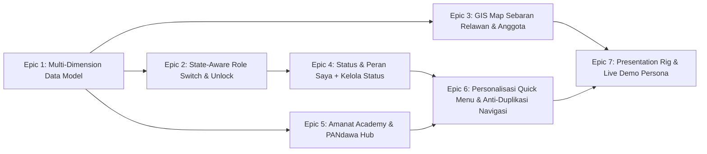
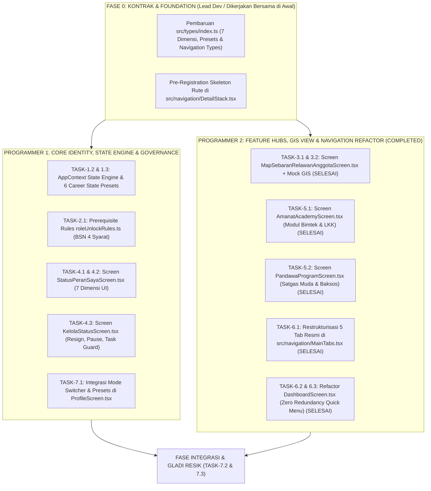

# DAFTAR TUGAS & BLUEPRINT PERSIAPAN PRESENTASI DPP PAN
## SAKSI 360 / simPAN Mobile — Ekosistem Digital Kader, Relawan, Caleg & Pengawal Suara PAN

**Dokumen:** Strategic Task List & Implementation Blueprint for DPP Presentation  
**Versi:** 1.6 (DPP PAN Ready — 2 Akun Komplementer, State Switcher Relawan Posko to Saksi TPS, & Zero Conflict)  
**Status:** Comprehensive Analysis & Master Action Plan  
**Target Pemangku Kepentingan:** Ketua Umum DPP PAN, Sekjen DPP PAN, Waketum / Kepala BSN PAN, Bapilu / KPPN, Pengelola simPAN, Amanat Academy & PANdawa  

---

## 1. Ringkasan Eksekutif & Narasi Presentasi DPP PAN

Aplikasi **SAKSI 360 / simPAN Mobile** telah bertransformasi dari sekadar alat pelaporan saksi di hari pemilihan menjadi **Platform Pengalaman Digital Terpadu Kader & Relawan Partai Amanat Nasional**.

Dalam presentasi di hadapan pimpinan DPP PAN, narasi utama yang diusung adalah:

> **"Satu Aplikasi, Satu Identitas (One Identity), Multi-Peran (Multi-Dimensional State), dan Pengawalan Suara Tanpa Batas — Menghubungkan Kaderisasi simPAN, Pembelajaran Amanat Academy, Kesamaptaan PANdawa, dan Ketajaman Saksi BSN PAN."**

Pimpinan DPP PAN tidak disuguhi aplikasi saksi ad-hoc yang mati setelah pemilu, melainkan platform partai yang hidup sepanjang tahun:
1. **Anggota Resmi & Pengurus:** Mengelola e-KTA digital, memantau struktur, mengakses warta resmi partai, serta memonitor konstituen pemenangan legislatif (Bacaleg/Caleg).
2. **Relawan Simpatisan:** Mengikuti kegiatan sapa warga, bursa tugas posko, dan memiliki jalur naik kelas (*unlockable journey*) menjadi kader resmi atau Saksi TPS ber-SK Mandat.
3. **Pilar Edukasi & Pengkaderan (Amanat Academy):** Pusat kompetensi publik, komunikasi politik, dan kepemimpinan kader.
4. **Pilar Satgas Kesiapsiagaan (PANdawa):** Wadah pasukan muda tangguh dan waspada yang siap mengawal marwah dan kegiatan partai di seluruh pelosok Indonesia.
5. **Peta Sebaran GIS (Executive View):** Representasi visual sebaran kekuatan relawan dan anggota resmi se-Indonesia sebagai referensi dari Web Command Center.
6. **Arsitektur Navigasi Bersih & Bebas Duplikasi (Zero Redundancy):** Setiap menu memiliki jalur akses tunggal yang jelas (*Single Distinct Access Path*), Quick Menu di Beranda terpersonalisasi secara presisi sesuai role dan operational role pengguna tanpa ada menu ganda yang membingungkan.
7. **Tata Kelola Status Mandiri & Humanis ("Kelola Status Saya"):** Alur pengunduran diri anggota berbasis review administrasi partai, opsi berhenti sementara (*paused*) atau berhenti permanen bagi relawan, perlindungan tugas aktif (*active assignment guard*), dan preservasi rekam jejak kontribusi tanpa *hard-delete*.

---

## 2. Arsitektur Data Identitas Multidimensi (The 7-Dimensional User State)

Sesuai instruksi desain, sistem **tidak lagi menggunakan enum tunggal** (misal: `ANGGOTA-CALEG-PENGURUS`), melainkan **Model 7 Dimensi Terkoordinasi**:

```text
USER (Akun Terpadu)
│
├── 1. MEMBERSHIP STATUS (Keanggotaan Partai)
│   ├── PENDING (Pendaftaran baru dalam verifikasi)
│   ├── ACTIVE (Anggota Resmi Ber-KTA simPAN)
│   ├── RESIGNATION_REQUESTED (Pengajuan pengunduran diri dalam review DPD/DPP)
│   ├── INACTIVE (Perlu pembaruan administrasi)
│   ├── SUSPENDED (Ditangguhkan oleh Mahkamah Partai)
│   └── ENDED (Resmi Mengundurkan Diri / Diberhentikan)
│
├── 2. KADER STATUS (Sesuai PP Perkaderan & PP Pencalegan PAN)
│   ├── NON_KADER (Tokoh masyarakat / simpatisan luar)
│   ├── CALON_KADER (Dalam proses orientasi)
│   └── KADER_AKTIF (Lulus LKK / LKPA / LKMA formal PAN)
│
├── 3. ORGANIZATIONAL POSITION & SCOPE (Hierarki Kepengurusan)
│   ├── Position: NONE | PENGURUS | KOORDINATOR | FUNGSIONAR | ANGGOTA_LEGISLATIF
│   ├── Scope Level: DPP (Pusat) | DPW (Provinsi) | DPD (Kab/Kota) | DPC (Kecamatan) | DPRt (Kelurahan)
│   └── Region / Specific Role: (Contoh: "Sekretaris DPD PAN Kota Bandung")
│
├── 4. ELECTORAL STATUS & METADATA (Siklus Pencalegan Pemilu/Pilkada)
│   ├── Status: NONE → BACALEG → CALEG → TERPILIH → ANGGOTA_LEGISLATIF
│   ├── Election Year: 2029 (atau Pilkada 2024/2029)
│   ├── Legislative Level: DPR_RI | DPRD_PROVINSI | DPRD_KAB_KOTA
│   ├── Electoral Area (Dapil): (Contoh: "Jawa Barat I / Dapil 3 Kota Bandung")
│   └── Period / Term: "Caleg PAN 2029" atau "Anggota DPRD 2024–2029"
│
├── 5. VOLUNTEER STATUS (Partisipasi Kerelawanan)
│   ├── NONE (Bukan relawan)
│   ├── PENDING (Pendaftaran relawan dalam proses)
│   ├── ACTIVE (Relawan aktif berkontribusi)
│   ├── PAUSED (Berhenti sementara / cuti kegiatan)
│   └── INACTIVE (Berhenti menjadi relawan, histori tetap aman)
│
├── 6. PROGRAM PARTICIPATION (Ekosistem Pengembangan)
│   ├── Amanat Academy: NONE | ENROLLED | ACTIVE | GRADUATED
│   ├── PANdawa: NONE | REGISTERED | SELECTED | TRAINING | ACTIVE | COMPLETED
│   └── Program Saksi BSN: NONE | TRAINING | CERTIFIED | MANDATED
│
└── 7. OPERATIONAL ROLES (Multi-Value Mode Kerja Lapangan)
    ├── VOLUNTEER (Relawan Lapangan)
    ├── WITNESS_CANDIDATE (Calon Saksi)
    ├── OFFICIAL_WITNESS (Saksi TPS Resmi Ber-Mandat)
    ├── TPS_COORDINATOR (Koordinator TPS Kluster)
    ├── FIELD_COORDINATOR (Koordinator Lapangan Kecamatan)
    └── TRAINER (Instruktur Bimtek)
```

---

## 3. Arsitektur Akun: 2 Akun Komplementer (Kader Full Lifecycle & Relawan Non-KTA)

> [!IMPORTANT]
> **Keputusan Arsitektur: 2 Akun Komplementer dengan Perpindahan Akun di `LoginScreen.tsx`:**
> 1. **Dua Entitas Nyata Partai (Opsi 2 Resmi):** Di lapangan, PAN berinteraksi dengan dua kelompok utama: **Kader/Anggota Resmi Ber-KTA** dan **Relawan Simpatisan Non-KTA** (anak muda, pemilih independen, relawan posko). Menyediakan 2 akun ini membuktikan kepada DPP PAN bahwa aplikasi mampu melayani struktur internal partai sekaligus merangkul massa publik secara inklusif.
> 2. **Perpindahan Akun Terpusat di Fitur "Login Cepat" (`src/screens/LoginScreen.tsx`):** Sesuai arahan arsitektur, pergantian antar kedua entitas akun ini dilakukan secara natural dan formal melalui fitur **Login Cepat (`QuickLoginPicker`) pada layar `LoginScreen.tsx`**. Presenter cukup logout untuk beralih antara perspektif Kader Resmi dan perspektif Relawan Simpatisan.
> 3. **Peran Tombol "Ganti Mode" di `ProfileScreen.tsx`:** Di dalam sesi akun yang sedang aktif (khususnya Akun Kader Ahmad Fauzan), tombol *"Ganti Mode"* berfungsi sebagai **Operational Role Switcher & Career State Presets Simulator** (mengubah peran operasional lapangan tanpa berganti identitas orang).

---

### Profil 2 Akun Komplementer Resmi:

| Parameter | 👤 Akun 1: Kader & Pengurus (Ahmad Fauzan) | 🤝 Akun 2: Relawan Murni Simpatisan (Siti Rahmawati) |
| :--- | :--- | :--- |
| **Email Akun** | `ahmad.fauzan@pan.go.id` | `siti.rahmawati@relawanpan.id` |
| **Status Keanggotaan** | `Membership: ACTIVE` (e-KTA simPAN Terverifikasi) | `Membership: NONE / UNREGISTERED` (Bukan Anggota) |
| **Status Relawan** | `Volunteer: ACTIVE` (Merangkap tugas lapangan) | `Volunteer: ACTIVE` (Relawan Murni Posko) |
| **Identitas Digital** | **e-KTA simPAN Resmi** (`PAN-3273-2024-00892`) | **Digital ID Relawan Simpatisan** (`REL-3273-2024-0042`) |
| **Fitur "Ganti Mode" Profil** | Memiliki **6 State Presets Karir Fungsionaris** (Anggota Baru $\rightarrow$ Saksi TPS $\rightarrow$ Koordinator $\rightarrow$ Caleg 2029) di modal *Ganti Mode* Profil | Memiliki **2 State Transisi Relawan**: (1) **Relawan Posko Lapangan** vs (2) **Relawan Mandat Saksi TPS** (dengan Level-Unlock 4 syarat BSN) |
| **Fitur di Kelola Status** | Lengkap: Pengajuan Pengunduran Diri Anggota + Jeda/Berhenti Relawan | Hanya opsi: Berhenti / Jeda Sementara Relawan (`PAUSED`). Tidak ada menu resign anggota |
| **Nilai Jual ke DPP PAN** | Membuktikan tata kelola pengkaderan terstruktur, pengamanan suara BSN, dan pemenangan caleg internal. | Membuktikan daya tarik aplikasi dalam merekrut generasi muda & simpatisan publik tanpa paksaan KTA di awal. |

### A. Matriks State Presets pada Akun 1 (Ahmad Fauzan — Kader Resmi):

Untuk mendemonstrasikan kelincahan 1 akun kader melintasi berbagai jenjang karir organisasi, akun **Ahmad Fauzan** dilengkapi dengan 6 State Presets yang dapat di-switch melalui tombol *"Ganti Mode"* di `ProfileScreen.tsx`:

1. **State 1 (Anggota Pemula):** KTA baru terbit, orientasi anggota baru di Beranda.
2. **State 2 (Kader LKK + Relawan Lapangan):** Lulus LKK di Amanat Academy, bertugas di posko & Satgas PANdawa, Diklat Saksi progress 80%.
3. **State 3 (Saksi TPS 014 Resmi BSN):** Telah mengantongi SK Mandat BSN, mode saksi bilik suara aktif penuh (Form C1 Plano & Presensi GPS).
4. **State 4 (Koordinator TPS DPC):** Diberi mandat supervisi 15 TPS di Kecamatan Sumur Bandung (monitoring saksi & broadcast tim).
5. **State 5 (Fungsionaris DPD & Caleg DPR-RI 2029):** Menjabat Sekretaris DPD Kota Bandung & Caleg Terdaftar Dapil Jabar I (menu peta basis suara & audit KPPN aktif).
6. **State 6 (Uji Kelola Status):** Simulasi pengajuan resign anggota (`RESIGNATION_REQUESTED`) dan jeda relawan (`PAUSED`) dengan dialog *Active Task Guard*.

### B. Matriks State Transisi pada Akun 2 (Siti Rahmawati — Relawan Murni):

Untuk memperagakan jalur naik kelas simpatisan masyarakat menjadi pengawal suara resmi partai, akun **Siti Rahmawati** memiliki 2 State Transisi pada tombol *"Ganti Mode"* di `ProfileScreen.tsx`:

1. **State R-1 (Relawan Posko & Lapangan - Default):**
   - **Peran Operasional:** `VOLUNTEER`
   - **Tampilan Beranda:** Bursa Tugas Aksi Posko, Presensi Giat Sosial/Baksos, dan Banner Onboarding: *"Tertarik Menjadi Kader Resmi? Ajukan e-KTA simPAN"*.
   - **Kondisi Saksi TPS:** Status **LOCKED (Terkunci)** dengan badge gembok emas: *"Kurang 1 Syarat: Selesaikan Modul Diklat Saksi BSN (Progress 80%)"*.
2. **State R-2 (Relawan Mandat Saksi TPS 018 Braga - Unlocked):**
   - **Peran Operasional:** `OFFICIAL_WITNESS`
   - **Tampilan Beranda:** Berubah total menjadi **Mode Kawal Suara TPS 018 Kel. Braga** (Tombol Unggah Form C1 Plano, Presensi TPS GPS, Checklist Kotak Suara, dan Tombol SOS Insiden).
   - **Digital ID:** Tetap mencantumkan identitas Siti Rahmawati sebagai Relawan Simpatisan, namun disematkan pita mandat resmi: *"Saksi Resmi Terakreditasi BSN — SK Mandat: BSN/DPD-BDG/2024/018"*.

---

## 4. Master Task List (Work Breakdown Structure)

Daftar tugas dibagi menjadi 7 Epic terstruktur, mencakup backend model, logic rules, UI/UX screens, hingga skenario gladi resik presentasi:



---

### EPIC 1: Perombakan Data Model Identitas Multidimensi & Context Store
*Tujuan: Memastikan fondasi sistem mengenali 7 layer identitas secara independen tanpa bug atau tumpang tindih state.*

- [ ] **TASK-1.1: Pembaruan Types Definitif (`src/types/index.ts`)**
  - Definisikan tipe `MembershipStatus`: `'pending' | 'active' | 'resignation_requested' | 'inactive' | 'suspended' | 'ended'`.
  - Definisikan tipe `KaderStatus`: `'non_kader' | 'calon_kader' | 'kader_aktif'`.
  - Definisikan tipe `OrganizationalPosition`:
    - `position`: `'NONE' | 'PENGURUS' | 'KOORDINATOR' | 'FUNGSIONAR' | 'ANGGOTA_LEGISLATIF'`
    - `level`: `'DPP' | 'DPW' | 'DPD' | 'DPC' | 'DPRT'`
    - `region`: string (misal: "DPD PAN Kota Bandung")
    - `roleTitle`: string (misal: "Ketua", "Sekretaris", "Bendahara", "Wakil Ketua")
  - Definisikan tipe `ElectoralStatusRecord`:
    - `status`: `'NONE' | 'BACALEG' | 'CALEG' | 'TERPILIH' | 'ANGGOTA_LEGISLATIF'`
    - `electionYear`: number (misal: 2029)
    - `legislativeLevel`: `'DPR_RI' | 'DPRD_PROV' | 'DPRD_KAB_KOTA'`
    - `dapil`: string (misal: "Jawa Barat I", "Dapil 3 Kota Bandung")
    - `periodLabel`: string (misal: "Caleg PAN 2029", "Periode 2024–2029")
  - Definisikan tipe `VolunteerStatus`: `'none' | 'pending' | 'active' | 'paused' | 'inactive'`.
  - Definisikan tipe `ProgramParticipationRecord`:
    - `amanatAcademy`: `'NONE' | 'ENROLLED' | 'ACTIVE' | 'GRADUATED'`
    - `pandawa`: `'NONE' | 'REGISTERED' | 'SELECTED' | 'TRAINING' | 'ACTIVE' | 'COMPLETED'`
    - `programSaksi`: `'NONE' | 'TRAINING' | 'CERTIFIED' | 'MANDATED'`
  - Definisikan tipe `OperationalRole`: `'VOLUNTEER' | 'WITNESS_CANDIDATE' | 'OFFICIAL_WITNESS' | 'TPS_COORDINATOR' | 'FIELD_COORDINATOR' | 'CALEG_OPS' | 'MEMBER'`.
  - Definisikan tipe `StatusLifecycleItem`:
    - `statusName`: string, `startDate`: string, `endDate`?: string, `term`: string, `source`: string, `verifiedBy`: string, `verificationDate`: string, `documentRef`?: string.
  - Gabungkan ke dalam interface `CurrentUser` baru dengan mempertahankan backward compatibility jika diperlukan.

- [ ] **TASK-1.2: Pemodelan 2 Akun Komplementer & State Presets Engine (`src/data/accounts.ts` & `src/utils/userContext.ts`)**
  - Definisikan **Akun 1 (Ahmad Fauzan - Kader & Anggota Resmi)**: `ahmad.fauzan@pan.go.id` dengan 7 layer identitas lengkap dan 6 State Presets perjalanan karir fungsionaris.
  - Definisikan **Akun 2 (Siti Rahmawati - Relawan Murni Simpatisan)**: `siti.rahmawati@relawanpan.id` dengan `membershipStatus: 'none'`, `volunteerStatus: 'active'`, ID Relawan Digital, dan banner onboarding kaderisasi simPAN.
  - Tambahkan konfigurasi akun ini ke dalam `ACCOUNTS` dan integrasikan dengan fitur Login Cepat di `LoginScreen.tsx`.

- [ ] **TASK-1.3: Full Frontend Reactive State Engine di AppContext (`src/context/AppContext.tsx`)**
  - Bangun state engine lokal 100% reaktif tanpa backend, mengelola state akun tunggal, status 7 dimensi, dan operational role.
  - Sediakan method mutasi state lokal dengan instant UI reactivity:
    - `applyCareerStatePreset(presetId: 'state_1' | 'state_2' | 'state_3' | 'state_4' | 'state_5' | 'state_6')` untuk demo instan di panggung DPP.
    - `switchOperationalRoleWithGuard(role: OperationalRole)` dengan validasi Level-Unlock.
    - `requestMembershipResignation(reason, notes)` $\rightarrow$ mutasi state ke `'resignation_requested'`.
    - `setVolunteerPause(isPaused, durationMonths)` $\rightarrow$ mutasi state ke `'paused'` atau kembali `'active'`.
    - `stopVolunteer(reason, notes)` $\rightarrow$ mutasi state ke `'inactive'` dengan preservasi histori & dialog active task guard.
    - `completeAcademyModule(moduleId)` $\rightarrow$ simulasi kelulusan diklat saksi yang seketika membuka peran Saksi TPS.

---

### EPIC 2: Fitur "Switch Mode Operational Role" yang State-Aware & Gamified (Level Unlock)
*Tujuan: Menyediakan selector peran operasional lapangan yang memeriksa kelayakan user secara ketat dan edukatif.*

- [ ] **TASK-2.1: Logika Pemeriksa Kelayakan (Eligibility & Prerequisite Rules Engine)**
  - Bangun validator prasyarat perpindahan peran di `src/utils/roleUnlockRules.ts`:
    - **Mode Relawan Biasa:** Terbuka untuk semua akun yang memiliki `volunteerStatus === 'active'`. (Jika `volunteerStatus === 'paused'` atau `'inactive'`, tampilkan opsi mengaktifkan kembali partisipasi).
    - **Mode Saksi TPS (Untuk Akun Relawan):**
      - *Syarat 1:* Menyelesaikan Kurikulum Bimtek Saksi di Amanat Academy (100% materi selesai).
      - *Syarat 2:* Lulus Evaluasi/Quiz Pemilu dengan skor minimal 80%.
      - *Syarat 3:* Verifikasi KTP & Pakta Integritas Saksi telah divalidasi BSN DPD.
      - *Syarat 4:* Telah diterbitkan SK Mandat Resmi Saksi KPU bertanda tangan digital.
      - *Jika belum terpenuhi:* Status **LOCKED** dengan meteran progres (misal: "3 dari 4 syarat terpenuhi").
    - **Mode Caleg Pemenangan (Untuk Anggota Resmi):**
      - *Syarat:* `electoralStatus === 'CALEG'` atau `'BACALEG'`.
      - *Jika bukan Caleg:* Tampilkan pesan: "Akses Terkunci. Mode ini khusus untuk Caleg resmi yang terdaftar di Komite Pemenangan Pemilu Nasional (KPPN) PAN. Buka menu Pendaftaran Bacaleg untuk registrasi."
    - **Mode Koordinator TPS / Lapangan:**
      - *Syarat:* Memiliki penugasan koordinator sah dari DPD/DPC dengan SK wilayah dampingan.

- [ ] **TASK-2.2: Komponen Interaktif Modal "Pilih Mode Operasional (Mode Saya)"**
  - Rancang ulang modal `showRoleModal` di `DashboardScreen.tsx` dan `ProfileScreen.tsx`.
  - Format visual kartu peran:
    - **Kartu Aktif:** Border biru PAN, badge "Sedang Digunakan", icon centang hijau.
    - **Kartu Siap Digunakan:** Border netral, tombol "Gunakan Mode Ini".
    - **Kartu Terkunci (Gamified Locked Card):** Icon gembok emas/abu-abu, label "Terkunci", progress bar syarat (misal: 75% Unlock Progress).
  - Ketukan pada kartu terkunci memunculkan **Interactive Unlock Requirement Sheet** yang merinci syarat apa yang sudah hijau (selesai) dan syarat apa yang masih merah/abu-abu, dilengkapi tombol aksi langsung (CTA):
    - Contoh: *Syarat belum selesai: Bimtek Saksi* -> Tombol: `[ Buka Amanat Academy ]`.
    - Contoh: *Syarat belum selesai: SK Mandat* -> Tombol: `[ Hubungi Korlap DPD ]`.

- [ ] **TASK-2.3: Konsekuensi Tampilan & Navigasi Saat Ganti Mode**
  - Mode Saksi TPS -> Beranda memunculkan: Status TPS Dampingan, Presensi GPS TPS, Input C1 Plano, Scan AI C1, Lapor Insiden Darurat.
  - Mode Relawan -> Beranda memunculkan: Bursa Tugas Posko, Giat Sapa Warga, Posko Dago, Kontak Korlap.
  - Mode Caleg Pemenangan -> Beranda memunculkan: Peta Suara Dapil, Progres Timses Lapangan, Target Suara Kursi Parlemen.
  - Mode Koordinator -> Beranda memunculkan: Supervisi Saksi Kluster, Rekap C1 Cepat, Broadcast Instruksi Lokal.

---

### EPIC 3: Peta Sebaran Relawan & Anggota Resmi (Executive GIS View)
*Tujuan: Menampilkan peta sebaran kekuatan kader dan pengawal suara se-Indonesia sebagai referensi dari Web Command Center (Information-Only).*

- [x] **TASK-3.1: Data Sebaran Wilayah Berjenjang (`src/data/sebaranRelawanAnggota.ts` / `src/data/gisRegionalData.ts`)**
  - Susun dataset agregat sebaran riil per DPW (Provinsi), DPD (Kab/Kota), dan kluster DPC/TPS (Coblong & Kota Bandung).
  - Sertakan metrik:
    - Total Kader Ber-KTA simPAN.
    - Total Relawan Terdaftar & Aktif.
    - Coverage Saksi TPS (% TPS terisi mandat saksi PAN).
    - Lokasi titik Posko Pemenangan utama (koordinat lat/lng).

- [x] **TASK-3.2: Screen Peta Sebaran (`src/screens/MapSebaranRelawanAnggotaScreen.tsx`)**
  - **Header Eksekutif:** Penanda *"DATA REFERENSI WEB COMMAND CENTER (READ-ONLY)"* dengan stempel waktu sinkronisasi terakhir.
  - **Peta Interaktif Visual:**
    - Render visual peta wilayah Indonesia / Jawa Barat / Bandung dengan pins posko, cluster anggota, dan polygon coverage.
    - Dukung filter switch:
      - `[ SEMUA ]` • `[ ANGGOTA RESMI ]` • `[ RELAWAN ]` • `[ SAKSI TPS ]`.
  - **Cards Ringkasan Wilayah:**
    - Kartu Statistik: Cakupan Wilayah (94.8%), Rasio Saksi (1.8 saksi/TPS), Posko Aktif (12 Posko).
    - Daftar Breakdown Kecamatan / Dapil: Menampilkan list kecamatan dengan progress bar kepadatan kader PAN.
  - **Aturan Keamanan Data (Privacy Guard):**
    - Sesuai Bab 24 AGENTS.md, tidak menampilkan NIK atau nomor HP pribadi secara publik pada peta titik; gunakan agregasi kluster.
  - Daftarkan screen ke `DetailStack.tsx` dan tautkan di Dashboard serta Menu Profil.

---

### EPIC 4: Layar "Status & Peran Saya", Modul "Kelola Status Saya", & Refactor Header Beranda
*Tujuan: Memberikan visualisasi transparan atas 7 lapisan identitas, menyediakan kontrol status mandiri (pengunduran diri anggota berjenjang, opsi berhenti sementara/tetap relawan, dan proteksi tugas aktif), serta header beranda ringkas.*

- [ ] **TASK-4.1: Layar Khusus "Status & Peran Saya" (`src/screens/StatusPeranSayaScreen.tsx`)**
  - Akses dari: **Profil → Status & Peran Saya**.
  - Tampilan visual berlapis kartu:
    1. **Kartu Keanggotaan (Membership):** Status 🟢 Anggota Aktif / 🟡 Dalam Proses Pengunduran Diri / ⚪ Ended, Nomor e-KTA simPAN, Tanggal Bergabung, Asal DPC/DPD.
    2. **Kartu Perkaderan (Kader Status):** Status 🟢 Kader Aktif Formal, Sertifikat LKK Madya, Asal Jalur Kaderisasi (Kader Murni vs Tokoh Masyarakat).
    3. **Kartu Organisasi (Kepengurusan):** Status 🔵 Pengurus DPD Kota Bandung, Jabatan Sekretaris DPD, Masa Khidmat 2020–2025, SK DPP No. PAN/A/Kpts/KU-SJ/082/2020.
    4. **Kartu Elektoral & Pemilu (Electoral):** Status 🟣 Caleg PAN 2029, Tingkat DPRD Provinsi, Dapil Jabar X, Status Verifikasi KPPN (Lolos Berkas).
    5. **Kartu Relawan (Volunteer):** Status 🟢 Relawan Aktif / 🟡 Berhenti Sementara (Paused) / ⚪ Inactive, Total 15 Aksi Lapangan, 12 Jam Bimtek.
    6. **Kartu Program Ekosistem (Programs):**
       - 🎓 Amanat Academy: Status *Aktif (8 Kelas Selesai, 3 Sertifikat)*.
       - 🛡 PANdawa: Status *Peserta Aktif Diklat Kesiapsiagaan*.
       - 🗳 Program Saksi: Status *Tersertifikasi BSN PAN*.
    7. **Timeline Riwayat Status (Lifecycle History):** Log perubahan peran lengkap dengan tanggal, verifikator, dan nomor surat keputusan.
    8. **Action Bar Bawah:** Tombol besar `[ Kelola Status Saya ]` mengarah ke layar `KelolaStatusScreen`.

- [ ] **TASK-4.2: Pembaruan Header Beranda (`DashboardScreen.tsx`)**
  - Buat sub-komponen header identitas multi-layer yang ringkas dan padat:
    - Baris 1: Nama Kader + Badge Verifikasi Biru.
    - Baris 2: Teks Gabungan Identitas: `Anggota PAN • Pengurus DPD • Caleg 2029`.
    - Baris 3: Badge Status Operasional Aktif saat ini: `Mode Operasional: Saksi TPS 001 Kel. Dago`.
  - Tombol Quick Actions mini: `[ Ganti Mode ]` dan `[ Status & Peran ]`.

- [ ] **TASK-4.3: Modul Baru: "Kelola Status Saya" (`src/screens/KelolaStatusScreen.tsx`)**
  - *Tujuan Arsitektur:* Mengakomodir tata kelola siklus hidup status secara independen tanpa menghapus akun (*Never Delete User Hard*).
  - **A. Bagian Keanggotaan (Membership):**
    - Tombol: `[ Pengajuan Pengunduran Diri Anggota ]`.
    - *Alur Workflow Administrasi Berjenjang:*
      `Anggota Aktif` $\rightarrow$ `Pilih Alasan Terstruktur (+ Catatan Tambahan)` $\rightarrow$ `Konfirmasi & Ketentuan Konsekuensi Hak Anggota` $\rightarrow$ `Kirim Pengajuan` $\rightarrow$ `Status Bergeser ke RESIGNATION_REQUESTED` $\rightarrow$ `Review Web Command Center / DPD` $\rightarrow$ `Status Akhir: ENDED`.
    - *Kaidah Desain:* Tidak langsung menonaktifkan status seketika di mobile karena ada prosedur organisasi dan pengembalian KTA. e-KTA digital diberi status "Dalam Proses Pengunduran Diri".
  - **B. Bagian Kerelawanan (Volunteer Status):**
    - Istilah: **"Berhenti Menjadi Relawan"** (bukan pengunduran diri).
    - *Tiga Pilihan Fleksibel bagi Relawan:*
      1. **Berhenti Sementara (`VOLUNTEER = PAUSED`):** Untuk relawan yang sedang sibuk pekerjaan atau studi dalam periode tertentu (1–6 bulan), status rehat tanpa keluar permanen.
      2. **Berhenti Menjadi Relawan (`VOLUNTEER = INACTIVE`):** Penghentian partisipasi tetap tanpa menghilangkan akun atau histori kontribusi.
      3. **Hak Privasi & Penghapusan Data (UU PDP):** Prosedur terpisah sesuai regulasi privasi dengan tetap menjaga keabsahan audit log pemilu.
    - *Form Alasan Terstruktur & Humanis (Pilihan Ringan):*
      - Kesibukan pekerjaan
      - Pendidikan / Studi
      - Pindah domisili / wilayah
      - Alasan kesehatan / pribadi
      - Tidak dapat aktif sementara waktu
      - Lainnya (+ Keterangan opsional)
  - **C. Active Task & Assignment Guard (Pencegahan Tugas Terbengkalai):**
    - Saat relawan menekan "Berhenti", sistem memeriksa apakah ada tugas aktif (`tasks` status `in_progress`) atau agenda terdaftar (`events` status `isRegistered`).
    - Jika ada, tampilkan modal peringatan: *"Anda masih memiliki X tugas aktif dan Y kegiatan terdaftar. Penghentian status relawan akan membatalkan atau mengalihkan tugas tersebut ke Koordinator Lapangan."*
    - Pilihan: `[ Selesaikan Tugas Dahulu ]` atau `[ Lanjutkan & Alihkan ke Korlap ]` (otomatis melepas slot di Bursa Tugas).
  - **D. Preservasi Histori (Zero History Loss):**
    - Riwayat masa lalu (misal: 12 tugas selesai, 8 kegiatan dihadiri, 4 training tuntas) **tetap tersimpan utuh** di rekam jejak aktivitas. Status relawan menjadi nonaktif, namun portofolio pengabdiannya tidak hilang.
  - **E. Independensi Program:**
    - Berhenti relawan tidak otomatis menghapus sertifikat Amanat Academy atau status alumni PANdawa. Masing-masing program memiliki siklus hidup tersendiri.

---

### EPIC 5: Ekosistem Amanat Academy & PANdawa Hub
*Tujuan: Membangun pilar pembelajaran dan kesiapsiagaan pemuda sesuai dokumen pengayaan PAN Mobile.*

- [x] **TASK-5.1: Layar Utama Hub Amanat Academy (`src/screens/AmanatAcademyScreen.tsx`)**
  - Re-branding & refactoring dari `WitnessAcademyScreen.tsx` menjadi Academy Hub seutuhnya.
  - Bagian-bagian utama:
    - **Header Personal:** Lanjutkan Belajar (*"Komunikasi Politik Lapangan — 80%"*) + Tombol *Lanjutkan*.
    - **Katalog Kursus Pilihan:**
      - *Kepemimpinan Politik PAN* (Wajib Kader).
      - *Public Speaking & Retorika Kampanye*.
      - *Strategi Advokasi Masalah Rakyat*.
      - *Etika dan Integritas Partai*.
    - **Jalur Khusus (Special Programs Banner):**
      - 🛡 **PANdawa:** Pasukan Muda Tangguh dan Waspada.
      - 🗳 **Program Saksi BSN PAN:** Pelatihan & Akreditasi Saksi TPS.
    - **Koleksi Sertifikat Digital:** Daftar sertifikat kelulusan lengkap dengan QR verifikasi.

- [x] **TASK-5.2: Modul Khusus PANdawa (`src/screens/PandawaProgramScreen.tsx`)**
  - **Overview Program:** Profil satgas kesiapsiagaan, pengamanan, dan pengawalan PAN ("Pasukan Muda Tangguh dan Waspada").
  - **Status Pendaftaran / Keikutsertaan:** Status user saat ini (`REGISTERED` / `TRAINING` / `ACTIVE`).
  - **Modul Diklat Disiplin & Kesiapsiagaan:** Modul kurikulum kesiapsiagaan fisik, safety awareness, pengawalan rapat umum, dan SOP darurat.
  - **Digital Credential PANdawa:** Kartu tanda anggota satuan tugas PANdawa dengan QR Pass terenkripsi.

- [x] **TASK-5.3: Jalur Khusus Akreditasi Saksi BSN PAN**
  - Integrasikan simulasi C1 Plano, kuis pemahaman regulasi PKPU, dan penerbitan sertifikat kompetensi saksi sebagai prasyarat unlock peran Saksi TPS.

---

### EPIC 6: Personalisasi Quick Menu Dashboard, Eliminasi Akses Ganda (Zero Redundancy), & Penyelarasan Navigasi
*Tujuan: Memastikan setiap fitur memiliki pintu akses tunggal yang jelas (Single Distinct Access Path), Quick Menu di Dashboard terpersonalisasi secara presisi sesuai role/operational role, dan mengeliminasi seluruh redundansi/duplikasi navigasi antar layar.*

#### A. Hasil Audit Codebase: Daftar Lengkap Screen dengan Duplikasi Akses yang Wajib Dieliminasi

Berdasarkan audit mendalam pada `src/screens/DashboardScreen.tsx`, `src/navigation/MainTabs.tsx`, dan `src/screens/ProfileScreen.tsx`, ditemukan **9 titik duplikasi akses** yang membuat user bingung dan merusak estetika aplikasi:

1. **`SimpanNewsScreen` (Warta & Berita Terkini):**
   - *Lokasi Duplikasi:* (a) Bottom Tab `NewsTab` di `MainTabs.tsx`; (b) Tombol "Lihat Semua" pada Card Berita di `DashboardScreen.tsx` (L-936); (c) Card Berita Highlight (L-945); (d) Baris Berita Mini (L-985).
   - *Akar Masalah:* Layar yang sama menampilkan kartu berita yang jika ditekan membuka tab Kabar yang isinya persis sama.
   - *Solusi Eliminasi:* Bottom Tab dipusatkan pada 5 pilar (News tidak lagi menjadi tab bottom). Di Dashboard, warta disajikan dalam bentuk **Ticker Maklumat Resmi DPP** ringkas (bukan card list berita panjang). Quick Menu sama sekali **TIDAK** memuat item Berita/Warta.

2. **`AssignmentLetterScreen` (Surat Tugas / Mandat Saksi):**
   - *Lokasi Duplikasi:* (a) Quick Menu Saksi TPS (L-380); (b) Tombol outline "Surat Mandat" pada Card Penugasan Saksi TPS di `DashboardScreen.tsx` (L-743 & L-873); (c) Menu Layanan di `ProfileScreen.tsx` (L-418).
   - *Akar Masalah:* Pada satu layar `DashboardScreen`, user melihat 2 tombol menuju Surat Mandat yang berjarak hanya 5 cm!
   - *Solusi Eliminasi:* Hapus Surat Mandat dari Quick Menu Saksi. Tempatkan akses Surat Mandat secara eksklusif dan kontekstual pada **Kartu Penugasan Saksi TPS** di Beranda, serta arsip resminya di menu **Profil → e-Mandat**.

3. **`ReportFormScreen` (Formulir Entri C1 Plano TPS):**
   - *Lokasi Duplikasi:* (a) Quick Menu Saksi TPS ("Entri C1 TPS", L-388); (b) Tombol "Lapor C1" pada Card Penugasan Saksi di `DashboardScreen.tsx` (L-731 & L-861).
   - *Akar Masalah:* Tombol entri C1 muncul dua kali berdampingan di Dashboard.
   - *Solusi Eliminasi:* Jadikan **Entri C1 Plano** sebagai salah satu icon Quick Menu utama untuk aksi taktis hari-H. Pada kartu Penugasan TPS di bawahnya, ubah menjadi **Status Monitor Suara TPS** (tanpa tombol duplikat Lapor C1, melainkan progress bar jumlah suara masuk).

4. **`SupervisionScreen` (Supervisi TPS Wilayah Koordinator):**
   - *Lokasi Duplikasi:* (a) Quick Menu Koordinator ("Supervisi TPS", L-302); (b) Tombol "Supervisi Wilayah" pada Card Ringkasan Koordinator di `DashboardScreen.tsx` (L-790).
   - *Akar Masalah:* Tombol supervisi muncul dobel di Quick Menu dan di kartu koordinator.
   - *Solusi Eliminasi:* Di kartu koordinator, jadikan data metrik klikabel ("12 TPS Dampingan $\rightarrow$ Detail"). Quick Menu Koordinator difokuskan untuk aksi taktis lapangan: `[ Broadcast Tim ]`, `[ Peta Sebaran GIS ]`, `[ Rekap Suara Cepat ]`, dan `[ Lapor Insiden SOS ]`.

5. **`WitnessListScreen` (Daftar Saksi TPS):**
   - *Lokasi Duplikasi:* (a) Quick Menu Koordinator ("Daftar Saksi", L-310); (b) Tombol "Status Saksi" pada Card Koordinator di `DashboardScreen.tsx` (L-802).
   - *Akar Masalah:* Menu personil saksi dipanggil dari Quick Menu dan dari kartu koordinator.
   - *Solusi Eliminasi:* Akses `WitnessList` dipusatkan pada metrik kartu koordinator ("24 Saksi Ditugaskan"), membebaskan slot Quick Menu untuk fitur baru yang esensial.

6. **`CheckInScreen` (Presensi GPS Lapangan):**
   - *Lokasi Duplikasi:* (a) Bottom Tab tengah `CheckInTab` di `MainTabs.tsx`; (b) Tombol "Presensi GPS" di Card Saksi `DashboardScreen.tsx` (L-719 & L-849).
   - *Akar Masalah:* Presensi GPS memakan 1 slot permanen di bottom bar padahal hanya dibutuhkan pada jam tertentu atau di lokasi kegiatan.
   - *Solusi Eliminasi:* Hapus Presensi dari Bottom Tab bar! Posisikan Presensi GPS secara kontekstual: (1) Floating Banner Hari-H bagi Saksi TPS; (2) Tombol Presensi di Detail Kegiatan/Tugas.

7. **`WitnessAcademyScreen` / `AmanatAcademyScreen` (Akademi & Pelatihan):**
   - *Lokasi Duplikasi:* (a) Quick Menu Relawan (L-271); (b) Quick Menu Member (L-349); (c) Bottom Tab `AcademyTab` (setelah penataan 5 tab).
   - *Akar Masalah:* Jika Academy menjadi Bottom Tab ke-4, maka menaruh "PAN Academy" di Quick Menu beranda adalah 100% duplikasi redundan.
   - *Solusi Eliminasi:* Hapus total "PAN Academy" dari Quick Menu di Beranda! Quick Menu berfokus pada aksi kerja/tugas lapangan, sementara pembelajaran terpusat di Bottom Tab **ACADEMY**.

8. **`ActivitiesScreen` & `TasksScreen` (Bursa Tugas & Agenda):**
   - *Lokasi Duplikasi:* (a) Quick Menu Relawan ("Bursa Tugas" redirect ke ActivitiesTab, L-262); (b) Card Agenda Terdekat di Beranda (L-897); (c) Bottom Tab Kegiatan.
   - *Akar Masalah:* Tombol Quick Menu me-redirect ke tab yang sudah terlihat di bottom bar.
   - *Solusi Eliminasi:* Pisahkan secara tegas: **Tab TUGAS** (Bursa Tugas & Tugas Lapangan) vs **Tab KEGIATAN** (Kalender & Rapat Konsolidasi). Quick Menu Relawan tidak lagi me-redirect ke tab general, melainkan membuka aksi spesifik: Form Aspirasi Warga, Titik Posko, atau Peta Sebaran GIS.

9. **`SimpanKtaScreen` (e-KTA Digital):**
   - *Lokasi Duplikasi:* (a) Quick Menu Member ("e-KTA simPAN", L-341); (b) Tombol "Buka e-KTA Penuh" di modal QR Pass (L-1120); (c) Hero card KTA bar di `ProfileScreen.tsx` (L-202).
   - *Akar Masalah:* e-KTA dibuka dari 3 pintu berbeda.
   - *Solusi Eliminasi:* Satukan pintu: Akses utama kartu e-KTA fisik digital berada di **Profil**, sedangkan di Beranda disederhanakan menjadi tombol mini **QR Pass** pada Active Role Strip untuk absensi cepat.

---

#### B. Matriks Personalisasi Quick Menu Dashboard (Bebas Duplikasi)

Quick Menu di `DashboardScreen.tsx` disusun dalam format **4-Kolom (1 Baris Esensial)** yang berubah secara dinamis sesuai Role dan Operational Role:

| Role & Operational Role | Quick Menu 1 | Quick Menu 2 | Quick Menu 3 | Quick Menu 4 | Prinsip Anti-Duplikasi & Rasional |
| :--- | :--- | :--- | :--- | :--- | :--- |
| **Relawan Biasa (Murni)** | **Peta Sebaran GIS**<br>(`MapSebaranRelawanAnggota`) | **Catat Aspirasi Warga**<br>(Modal Form Aspirasi) | **Titik Posko Wilayah**<br>(`SimpanOffices`) | **Kontak Korlap**<br>(Modal Kontak Korlap) | • Bebas dari tombol "Bursa Tugas" (ada di tab Tugas)<br>• Bebas dari "Academy" (ada di tab Academy)<br>• Bebas dari "Kabar/Berita" (ada di warta ticker) |
| **Relawan Siaga Saksi (In-Training)** | **Status Unlock Saksi**<br>(Modal Level Unlock) | **Peta Sebaran GIS**<br>(`MapSebaranRelawanAnggota`) | **Catat Aspirasi Warga**<br>(Modal Form Aspirasi) | **Kontak Korlap**<br>(Modal Kontak Korlap) | • Akses instan ke progres 4 syarat unlock peran Saksi TPS tanpa menduplikasi tab Academy |
| **Anggota Biasa (Non-Pengurus)** | **Struktur Pengurus**<br>(`SimpanStructure`) | **Peta Sebaran GIS**<br>(`MapSebaranRelawanAnggota`) | **Kantor Sekretariat**<br>(`SimpanOffices`) | **Transparansi Hub**<br>(`TransparencyHub`) | • Fokus pada pengenalan partai & transparansi<br>• Tidak ada tombol KTA ganda (sudah di profil & QR Pass strip) |
| **Anggota + Pengurus DPD/DPW** | **Struktur Pengurus**<br>(`SimpanStructure`) | **Peta Sebaran GIS**<br>(`MapSebaranRelawanAnggota`) | **Sekretariat DPD**<br>(`SimpanOffices`) | **Transparansi Hub**<br>(`TransparencyHub`) | • Berorientasi pada tata kelola kepengurusan daerah dan monitoring sebaran kader |
| **Anggota + Caleg / Bacaleg 2029** | **Peta Basis Dapil**<br>(`MapSebaranRelawanAnggota`) | **Pendaftaran Bacaleg**<br>(`SimpanBacaleg`) | **Audit Berkas KPPN**<br>(Modal Audit Berkas) | **Struktur Pengurus**<br>(`SimpanStructure`) | • Terfokus pada instrumen pemenangan elektoral caleg dan verifikasi berkas pencalegan |
| **Saksi TPS Resmi (Hari-H)** | **Presensi GPS Bilik**<br>(`CheckIn`) | **Entri C1 Plano**<br>(`ReportForm`) | **Scan AI Vision C1**<br>(`C1Ocr`) | **Lapor Insiden SOS**<br>(`EmergencyForm`) | • Quick menu berisi 4 aksi taktis utama saksi<br>• Kartu di bawahnya murni kartu monitoring TPS (tanpa tombol C1 & Presensi ganda) |
| **Koordinator TPS / Lapangan** | **Supervisi TPS Kluster**<br>(`Supervision`) | **Peta Sebaran GIS**<br>(`MapSebaranRelawanAnggota`) | **Kirim Broadcast Tim**<br>(`Broadcast`) | **Lapor Insiden Darurat**<br>(`EmergencyForm`) | • Menghapus tombol "Daftar Saksi" & "Supervisi Wilayah" yang tadinya tumpang tindih antara Quick Menu dan kartu |

---

#### C. Rincian Task Implementasi EPIC 6

- [x] **TASK-6.1: Audit & Refactor Quick Menu Generator di `src/screens/DashboardScreen.tsx`**
  - Perbarui fungsi `getQuickMenuItems()` agar mengikuti Matriks Personalisasi Quick Menu di atas.
  - Saring item berdasarkan `currentUser.currentRole`, `currentUser.electoralStatus`, dan `currentUser.candidateStatus`.
  - Hapus semua pemanggilan rute duplikat (`NewsTab`, `ActivitiesTab`, `SimpanKta`, `WitnessAcademy`).

- [x] **TASK-6.2: Refactor Card Penugasan Saksi, Koordinator, & Warta di `src/screens/DashboardScreen.tsx`**
  - **Pada Kartu Saksi:** Hapus tombol duplikat "Lapor C1" dan "Surat Mandat". Kartu difokuskan menampilkan status bilik TPS, progress DPT hadir, dan nomor mandat resmi.
  - **Pada Kartu Koordinator:** Hapus tombol duplikat "Supervisi Wilayah" dan "Status Saksi". Jadikan angka statistik dapat diklik langsung ke layar terkait.
  - **Pada Bagian Warta:** Ganti card list berita panjang dengan **Ticker Maklumat Resmi DPP** yang terintegrasi rapi dengan modal arahan instruksi partai.

- [x] **TASK-6.3: Restrukturisasi Bottom Navigation (`src/navigation/MainTabs.tsx`) ke 5 Pilar Resmi**
  - Hapus tab `NewsTab` dan `CheckInTab` dari bottom tab bar.
  - Susun 5 tab standar sesuai blueprint pengayaan:
    1. **BERANDA (`HomeTab`):** Dashboard terpersonalisasi bebas duplikasi.
    2. **TUGAS (`TasksTab`):** Bursa Tugas, Tugas Aksi Lapangan, & Presensi Penugasan.
    3. **KEGIATAN (`ActivitiesTab`):** Agenda Rapat, Konsolidasi, Baksos, & Kalender Partai.
    4. **ACADEMY (`AcademyTab`):** Amanat Academy Hub, PANdawa, & Program Saksi.
    5. **PROFIL (`ProfileTab`):** e-KTA simPAN, Status & Peran Saya, Pengaturan Akun.

- [x] **TASK-6.4: Pemutakhiran Detail Stack Navigator (`src/navigation/DetailStack.tsx`)**
  - Daftarkan screen baru:
    - `StatusPeranSayaScreen` (Status & Peran 7 Dimensi).
    - `KelolaStatusScreen` (Modul Kelola Status Mandiri & Pengunduran Diri/Pause).
    - `MapSebaranRelawanAnggotaScreen` (Peta Sebaran GIS).
    - `AmanatAcademyScreen` (Hub Pembelajaran Amanat Academy).
    - `PandawaProgramScreen` (Modul Satgas Kesiapsiagaan PANdawa).
  - Pastikan setiap screen memiliki header title, tombol kembali (back), dan bell notifikasi.

- [x] **TASK-6.5: Verifikasi Anti-Duplikasi Navigasi (Zero Redundancy Audit)**
  - Uji alur navigasi tiap role: pastikan tidak ada layar yang dapat diakses dengan 2 tombol berbeda dari layar yang sama.
  - Pastikan pengalaman pengguna terasa rapi, intuitif, dan bebas dari kebingungan navigasi.

---

### EPIC 7: Skenario Gladi Resik & Presentation Rig DPP PAN
*Tujuan: Memastikan saat presentasi di hadapan pimpinan DPP PAN, aplikasi berjalan 100% tanpa kendala teknis dan alur demonstrasi memukau.*

- [ ] **TASK-7.1: Penyempurnaan Login Cepat (`LoginScreen.tsx`) & Mode Switcher (`ProfileScreen.tsx`)**
  - **A. Pada `src/screens/LoginScreen.tsx` (Fitur Login Cepat):**
    - Perbarui `QuickLoginPicker` agar menampilkan 2 kartu akun representatif utama:
      1. 👤 **Ahmad Fauzan** — *Kader & Anggota Resmi simPAN (Full Lifecycle)*.
      2. 🤝 **Siti Rahmawati** — *Relawan Simpatisan Non-KTA (Bursa Tugas & Posko)*.
    - Satu sentuhan langsung login ke profil yang dipilih tanpa perlu mengetik email/password saat demo panggung.
  - **B. Pada `src/screens/ProfileScreen.tsx` (Fitur Ganti Mode yang Adaptif):**
    - Tombol chip eksisting `Ganti Mode` di samping nama user membuka modal yang menyesuaikan profil akun aktif:
      - **Jika Login sebagai Ahmad Fauzan (Kader):** Menampilkan selector peran operasional fungsionaris & 6 State Presets Karir (Anggota Baru $\rightarrow$ Saksi TPS $\rightarrow$ Korlap $\rightarrow$ Caleg 2029).
      - **Jika Login sebagai Siti Rahmawati (Relawan):** Menampilkan switcher transisi **State R-1 (Relawan Posko)** $\leftrightarrow$ **State R-2 (Relawan Mandat Saksi TPS 018)** dengan visual meteran Level-Unlock 4 syarat BSN & tombol simulasi kelulusan diklat.
- [ ] **TASK-7.2: Checklist Skenario Demo Live di Depan DPP PAN (Akun Tunggal State-Aware):**
  - [ ] **Scene 1: Login Cepat Akun Kader Resmi (Ahmad Fauzan)**. Masuk dari Login Cepat `LoginScreen.tsx`, tunjukkan profil kader ber-eKTA resmi, State 5 (Sekretaris DPD & Caleg DPR-RI 2029), Quick Menu khusus caleg (Peta Basis Dapil & Audit KPPN), dan ketiadaan menu duplikat.
  - [ ] **Scene 2: Eksplorasi Status & Peran Saya**. Buka menu dari Profil, paparkan visualisasi 7 dimensi identitas kader yang transparan kepada pimpinan DPP PAN.
  - [ ] **Scene 3: Pengujian Modul Kelola Status (State 6)**. Buka **[ Kelola Status Saya ]**, simulasikan pengajuan pengunduran diri anggota (status bergeser ke `RESIGNATION_REQUESTED`), dan simulasi jeda relawan (`PAUSED`) yang memicu peringatan *Active Task Guard*. Tunjukkan bahwa akun dan histori tidak pernah di-*hard delete*.
  - [ ] **Scene 4: Peta Sebaran Relawan & Anggota Resmi (GIS View)**. Buka dari Quick Menu Beranda, perlihatkan agregasi kekuatan kader di Dapil Jabar I & Kota Bandung.
  - [ ] **Scene 5: Beralih ke Akun Relawan Murni (Siti Rahmawati)**. Lakukan logout $\rightarrow$ di `LoginScreen.tsx`, ketuk kartu **Siti Rahmawati (Relawan Simpatisan)**. Perlihatkan tampilan relawan murni: Digital ID Relawan (non-KTA), bursa tugas aksi sosial, ajakan daftar anggota simPAN, dan tantangan gamified unlock Saksi BSN.
  - [ ] **Scene 6: Pembelajaran & Level Unlock Real-Time**. Buka tab **ACADEMY**, klik selesaikan modul saksi $\rightarrow$ kembali ke Beranda, peran Saksi TPS otomatis ter-unlock! Alihkan ke Mode Saksi TPS (State 3), dan perlihatkan Quick Menu berubah menjadi menu Hari-H (C1 Plano, Presensi TPS GPS, SOS Insiden).
  - [ ] **Scene 7: Program Satgas PANdawa**. Tunjukkan modul PANdawa sebagai bukti kesiapsiagaan kader muda partai.
  - [ ] **Scene 8: Keandalan Offline Mode**. Matikan koneksi, simulasikan input form $\rightarrow$ tersimpan di antrean offline lokal $\rightarrow$ koneksi nyala $\rightarrow$ sinkronisasi otomatis.
- [ ] **TASK-7.3: Quality Assurance & Polish Eksekutif**
  - Pastikan tipografi Poppins konsisten di seluruh layar.
  - Pastikan kontras warna PAN (#0066B3, #002B52, #E60012) tajam dan profesional baik di Light Mode maupun Dark Mode.
  - Uji seluruh link tombol (zero broken links dan zero redundant access).
- [x] **TASK-7.4: Eliminasi Duplikasi Menu Profil, Filter Berbasis Role, & Pembersihan Total Emoji (Zero Emoji Policy - SELESAI):**
  - [x] **Eliminasi Duplikasi Menu Profil:** Menghapus card "Layanan & Pengaturan" di Profil yang menduplikasi menu E-Mandat, Keamanan, Transparansi, dan Pusat Bantuan. Memindahkan akses riwayat aktivitas langsung ke card Rekam Jejak dan Quick Menu direktori.
  - [x] **Pembersihan Redundansi Direktori:** Menghapus `kelola-status` (sub-alur `StatusPeranSaya`), memisahkan `simpan-kta` (hanya `MEMBER`) dan `register-member` (hanya `VOLUNTEER`), serta memisahkan `witness-academy` (khusus `WITNESS`) dan `amanat-academy`.
  - [x] **Filter Direktori Role-First:** Seluruh kategori tab (`Semua`, `Tugas`, `Edukasi`, `Organisasi`) dan kolom pencarian menu membatasi pencarian hanya pada item yang sah untuk role aktif pengguna (`roleAccessibleItems`), mencegah kebocoran fitur antar-role.
  - [x] **Pembersihan Total Emoji (Zero Emoji Policy):** Seluruh emoji di aplikasi (seperti `⭐`, `📋`, `🎓`, `🏛️`, `📍`, `🚩`, `🇮🇩`, `🏆`, `🔒`, `✓`, `▲`, `▼`) 100% diganti dengan vector icon resmi (`Feather` & SVG icon) di seluruh screen: `ProfileScreen`, `MapSebaranRelawanAnggotaScreen`, `MoreMenuScreen`, `QuickCountGameScreen`, `CheckInScreen`, `DocumentationScreen`, `SimpanNewsScreen`, `WitnessQuizModal`, `AssignmentLetterScreen`, `PartyRosterScreen`, `TasksScreen`, `TransparencyHubScreen`, `VerifyLetterScreen`.

---

## 5. Matriks Pembagian Kerja 2 Programmer Bebas Konflik (Zero-Conflict 2-Developer Parallel Architecture)

Untuk menjamin sprint dapat dikerjakan secara paralel oleh **2 Programmer** tanpa terjadi *merge conflict*, tabrakan tipe (*type collision*), maupun tumpang tindih state (*state race*), arsitektur kerja dibagi menjadi **Fase 0 (Penyelarasan Kontrak)** yang dilanjutkan dengan **2 Jalur Mandiri (Stream A & Stream B)**:

### 5.1 Diagram Alur Kerja Paralel (Zero-Conflict Flow)



### 5.2 Matriks Kepemilikan File & Domain (Single File Ownership Matrix)

Prinsip utama agar 0% conflict: **Satu file hanya boleh dimodifikasi oleh satu programmer dalam satu sprint**.

| Programmer | Domain Tanggung Jawab | File yang Boleh Dimodifikasi | File Baru yang Dibuat | Larangan / Pantangan |
| :--- | :--- | :--- | :--- | :--- |
| **Programmer 1**<br>*(Core State & Governance)* | • State Management Global<br>• Model 7 Dimensi & Presets<br>• Validasi Syarat BSN<br>• Profil & Kelola Status | • `src/context/AppContext.tsx`<br>• `src/screens/ProfileScreen.tsx`<br>• `src/data/accounts.ts`<br>• `src/utils/userContext.ts` | • `src/utils/roleUnlockRules.ts`<br>• `src/screens/StatusPeranSayaScreen.tsx`<br>• `src/screens/KelolaStatusScreen.tsx` | ❌ Dilarang menyentuh `DashboardScreen.tsx` dan `MainTabs.tsx`. |
| **Programmer 2**<br>*(Hubs, GIS & Navigation)* | • Hub Edukasi & Pemuda<br>• GIS Sebaran Relawan/Kader<br>• Pembersihan Duplikasi Navigasi<br>• 5 Tab Bar Resmi | • `src/screens/DashboardScreen.tsx`<br>• `src/navigation/MainTabs.tsx`<br>• `src/screens/TasksScreen.tsx`<br>• `src/screens/ActivitiesScreen.tsx` | • `src/screens/MapSebaranRelawanAnggotaScreen.tsx`<br>• `src/screens/AmanatAcademyScreen.tsx`<br>• `src/screens/PandawaProgramScreen.tsx`<br>• `src/data/gisRegionalData.ts` | ❌ Dilarang menyentuh `AppContext.tsx` dan `ProfileScreen.tsx`. |

### 5.3 Protokol Git & Interface Handshake

1. **Fase 0 (Pre-Branching Protocol):**
   - Lead dev melakukan pembaruan `src/types/index.ts` dan mendaftarkan skeleton screen di `src/navigation/DetailStack.tsx`.
   - Commit & push ke branch `main`/`dev`. Keduanya pull branch ini sebelum checkout branch masing-masing:
     - Programmer 1: `git checkout -b feature/stream-a-core-identity`
     - Programmer 2: `git checkout -b feature/stream-b-hubs-navigation`
2. **Aturan Konsumsi State (Interface Handshake):**
   - Programmer 2 tidak perlu mengubah `AppContext.tsx`. Programmer 2 cukup menggunakan *hook* `useApp()` yang sudah terdefinisi untuk membaca data peran dan memicu aksi yang sudah disepakati (misal: `useApp().activeOperationalRole`, `useApp().completeAcademyModule('bsn_bimtek')`).
   - Mock data GIS (`gisRegionalData.ts`) dibuat mandiri oleh Programmer 2 di folder `src/data/`, tanpa mengganggu `accounts.ts`.
3. **Fase Sinkronisasi & Merge:**
   - Setelah Stream A dan Stream B selesai diuji pada unit masing-masing, lakukan pull request ke `dev` secara berurutan (Stream A terlebih dahulu, lalu Stream B).
   - Pengujian integrasi skenario DPP PAN (TASK-7.2) dilakukan bersama di branch `dev`.

---

## 6. Rencana Tahapan Eksekusi (Implementation Roadmap)

| Fase | Fokus Pekerjaan | Estimasi Output |
| :--- | :--- | :--- |
| **Fase 1 (Fondasi Data & State)** | Eksekusi Epic 1 & Epic 2: Data Model 7 Dimensi, Rule Engine Unlock, & Modal State-Aware. | Model data siap, Persona A-F aktif di mock context, selector peran state-aware berjalan. |
| **Fase 2 (Fitur Unggulan GIS & Profil)** | Eksekusi Epic 3 & Epic 4: Peta Sebaran GIS, Layar Status & Peran Saya, Modul Kelola Status Saya + Header Dashboard. | Peta sebaran visual interaktif aktif, layar 7 lapis identitas terintegrasi di profil, alur kelola status mandiri aktif. |
| **Fase 3 (Navigasi Bersih & Enrichment)** | Eksekusi Epic 5 & Epic 6: Amanat Academy Hub, PANdawa Screen, Personalisasi Quick Menu, Eliminasi Duplikasi, & 5 Bottom Tabs. | Quick Menu beranda bebas duplikasi, tab Academy aktif di bar navigasi, alur peran bersih. |
| **Fase 4 (Gladi Resik & QA Eksekutif)** | Eksekusi Epic 7: 1-Click Demo Rig, Verifikasi Offline Queue, & Uji Coba Skenario Panggung. | Build APK stabil, zero crash, siap presentasi di hadapan pimpinan DPP PAN. |

---

## 7. Kesimpulan & Nilai Jual untuk DPP PAN

Dengan menyelesaikan seluruh daftar tugas di atas:
1. DPP PAN akan melihat bahwa **tim pengembang memahami kultur, aturan AD/ART, dan mekanisme organisasi partai** (pembedaan kader vs anggota, pencalegan bertahap, peran berjenjang, tata kelola BSN, dan alur administrasi pengunduran diri yang tertib).
2. Aplikasi mobile ini menjadi **aset strategis jangka panjang PAN**, bukan proyek sesaat, karena mampu menggerakkan perkaderan digital (Amanat Academy), merangkul anak muda tangguh (PANdawa), memberdayakan relawan, memfasilitasi caleg, dan mengamankan suara pemilu (SAKSI 360).
3. **Kualitas Pengalaman Pengguna (UX) Kelas Eksekutif:** Dengan meniadakan akses ganda dan mempersonalisasikan Quick Menu secara presisi, aplikasi terasa solid, ringkas, dan intuitif layaknya aplikasi perbankan modern dan platform partai kelas dunia.
4. **Sistem Pengelolaan Status yang Berintegritas:** Modul "Kelola Status Saya" membuktikan bahwa sistem tidak gegabah menghapus data kader/relawan (*never delete user hard*), melindungi rekam jejak kontribusi, dan mengamankan tugas lapangan yang sedang berjalan.