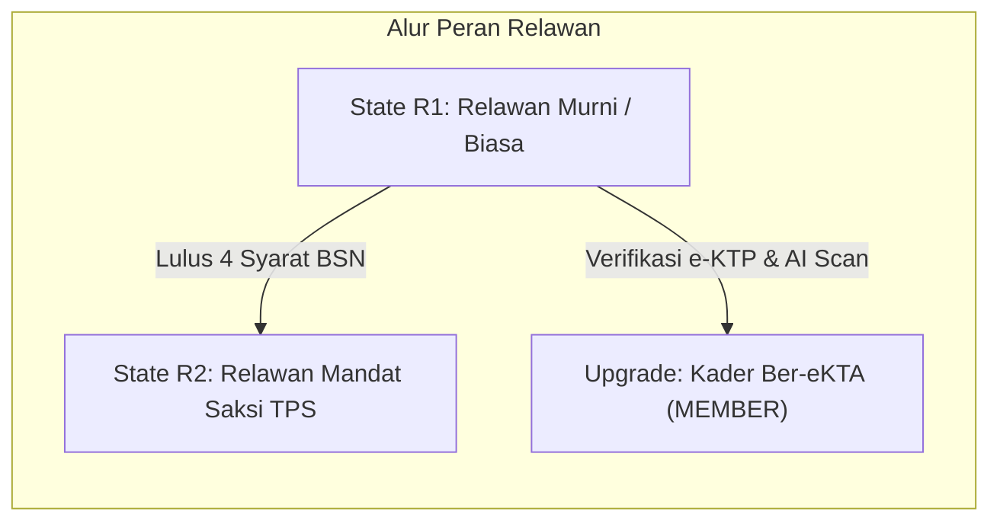

# Master Plan: Penyelarasan Menu, Role-Based Access Control (RBAC), & Eliminasi Duplikasi Akses Multi-Role Aplikasi simPAN 360

Dokumen ini merupakan cetak biru (*master blueprint*) teknis, arsitektural, dan operasional untuk menata ulang seluruh sistem navigasi, menu, dan hak akses multi-peran pada aplikasi **simPAN 360 (Partai Amanat Nasional)**. Rencana ini mengintegrasikan dan memperluas rencana **Opsi A** pada [`implementation_plan.md`](file:///c:/Users/MyBook%20SAGA%2010/.gemini/antigravity/brain/eababe3a-4d1e-41ed-a24a-c6f7162902e3/implementation_plan.md) untuk mencakup seluruh peran resmi aplikasi secara komprehensif, kritis, dan presisi.

---

## 1. Executive Summary & Filosofi Arsitektur Navigasi Opsi A

### 1.1 Tri-Layer Architecture (Pemisahan Tegas 3 Lapis Navigasi)
Untuk menghilangkan kebingungan pengguna (terutama segmen lansia, pemilih pemula, saksi lapangan, hingga fungsionaris DPP), sistem antarmuka dibagi menjadi 3 lapis peran yang tidak boleh saling tumpang tindih:

```
┌─────────────────────────────────────────────────────────────────────────────┐
│ LAPIS 1: BOTTOM NAVIGATION BAR (3 TAB UTAMA - PERSISTEN)                     │
│ [ Beranda (HomeTab) ]   •   [ Presensi GPS (CheckInTab) ]   •   [ Profil (ProfileTab) ] │
└──────────────────────────────────────┬──────────────────────────────────────┘
                                       │
            ┌──────────────────────────┴──────────────────────────┐
            ▼                                                     ▼
┌──────────────────────────────────────┐  ┌──────────────────────────────────────┐
│ LAPIS 2: BERANDA (DASHBOARD SCREEN)  │  │ LAPIS 3: PROFIL & DIREKTORI LAYANAN  │
│ -> Aksi Harian Cepat (Action-Oriented│  │ -> Identitas, Portofolio, & Legalitas│
│                                      │  │                                      │
│ • Greeting & Kartu QR Sesuai Peran   │  │ • Kartu Identitas & Rekam Jejak      │
│ • Quick Menu: Tepat 4 Menu Esensial  │  │ • Grid 4-Kolom ("Direktori Layanan"):│
│ • Kartu Status Penugasan Dinamis     │  │   HANYA Modul Operasional & Edukasi  │
│ • Feed Warta & Agenda Terdekat       │  │ • List Bawah ("Layanan & Pengaturan"):│
│                                      │  │   HANYA Tata Kelola Akun & Legalitas │
└──────────────────────────────────────┘  └──────────────────────────────────────┘
```

### 1.2 Kaidah Emas Nol Duplikasi (Zero-Duplication Golden Rules)
1. **Aturan 1 (Tab Exclusivity)**: Fitur yang telah memiliki Tab Bar utama permanen (seperti **Presensi Kehadiran GPS**) **DILARANG** dimasukkan ke dalam icon Grid Profil.
2. **Aturan 2 (Separation of Concerns Profil)**:
   - **Grid 4-Kolom Atas**: Didedikasikan 100% untuk **Aksi Operasional Lapangan, Edukasi/Perkaderan, dan Direktori Basis Partai**.
   - **List View Bawah**: Didedikasikan 100% untuk **Administrasi Keanggotaan, Legalitas SK/Mandat, Pengaturan Akun, Keamanan PIN, dan Bantuan**.
   - **Nol Duplikasi**: Tidak boleh ada satu pun menu di Grid yang muncul kembali di List bawahnya.
3. **Aturan 3 (Strict Role-Based Scoping)**: Pengguna hanya boleh melihat menu yang legal dan sesuai dengan peran aktif (`role`) serta status penugasan (`state`). Fitur tingkat saksi/korlap/caleg tidak boleh bocor ke relawan murni.

---

## 2. Audit Kritis & Diagnosa Masalah Sistemik

Berdasarkan inspeksi menyeluruh pada [`DashboardScreen.tsx`](file:///d:/Coding/asqi/simpan/360-mobile/src/screens/DashboardScreen.tsx), [`ProfileScreen.tsx`](file:///d:/Coding/asqi/simpan/360-mobile/src/screens/ProfileScreen.tsx), dan [`userContext.ts`](file:///d:/Coding/asqi/simpan/360-mobile/src/utils/userContext.ts):

### 2.1 Masalah 1: Bypass Total Filter Peran di Profil
- **Kondisi Kode**: Pada [`ProfileScreen.tsx#L499-L548`](file:///d:/Coding/asqi/simpan/360-mobile/src/screens/ProfileScreen.tsx#L499-L548), variabel pengaman `roleAccessibleItems` telah dikalkulasi, namun pada implementasi rendering grid (`displayedDirectoryItems`) yang dipanggil justru konstanta mentah `DIRECTORY_PAGES` (berisi seluruh 27 menu).
- **Dampak Kritis**:
  - Relawan Murni (`VOLUNTEER` state `state_r1`) dapat melihat dan menekan menu **C1 Plano AI OCR**, **Supervisi Komando**, **Daftar Saksi**, **E-Mandat**, **Detail TPS**, hingga **Bacaleg 2029**.
  - Koordinator Lapangan melihat menu pendaftaran KTA yang tidak relevan bagi tugas taktis mereka.
  - Anggota resmi yang sudah memiliki e-KTA tetap melihat menu pendaftaran anggota baru.

### 2.2 Masalah 2: Redundansi Ekstrem Vertikal (Grid vs List di Profil)
Pengguna disajikan 8 pasang menu kembar secara berturut-turut pada satu halaman scroll yang sama:

| Modul Layanan | Kemunculan di Grid 4-Kolom | Kemunculan di List Pengaturan Bawah | Dampak UI/UX |
| :--- | :--- | :--- | :--- |
| **Registrasi e-KTA** | Icon `Daftar KTA` | Row `Pengajuan Anggota Resmi simPAN` | Membingungkan (muncul 3x dengan banner) |
| **Mandat Saksi TPS** | Icon `Unlock Saksi` | Row `Unlock Mandat Saksi TPS` | Redundan & memakan ruang vertikal |
| **Status 7 Dimensi** | Icon `Status Peran` | Row `Status & Peran Saya` | Membuka screen yang persis sama |
| **Kelola Partisipasi** | Icon `Kelola Status` | Row `Kelola Status & Partisipasi` | Membuka screen yang persis sama |
| **Keamanan Akun** | Icon `Keamanan PIN` | Row `Keamanan & Privasi Akun` | Redundansi fungsi pengaturan |
| **Pusat Bantuan** | Icon `Pusat Bantuan` | Row `Pusat Bantuan & Panduan` | Redundansi fungsi FAQ/Call Center |
| **Transparansi Partai** | Icon `Transparansi` | Row `Transparansi & Akuntabilitas` | Redundansi dokumen publik |
| **Riwayat Tugas** | Icon `Aktivitas` | Row `Riwayat Aktivitas & Penugasan` | Ditambah tombol di card rekam jejak (3x) |

### 2.3 Masalah 3: Redundansi Horisontal (Cross-Screen Collision)
- **Presensi GPS**: Muncul di Tab Bar Bawah (`CheckInTab`), muncul di Quick Menu Beranda, dan muncul lagi di Grid Profil.
- **Broadcast / Saluran Resmi**: Muncul permanen di Quick Menu Beranda (paling kanan), namun masih memakan slot icon di Grid Profil.
- **Warta & Berita PAN**: Muncul sebagai kartu utama di Beranda lengkap dengan tombol "Lihat Semua", namun masih muncul di Grid Profil.

---

## 3. Blueprint Komprehensif Arsitektur Menu per Role & State

Berikut adalah rancangan detail tata letak, menu, dan kondisi akses untuk kelima peran utama:

---

### 3.1 Role: VOLUNTEER (Relawan Simpatisan)

Relawan adalah garda terdepan sapa warga, kegiatan sosial posko, dan pengawalan suara akar rumput.



#### A. State R1: Relawan Murni / Biasa (`state_r1`)
- **Karakteristik**: Simpatisan non-KTA, belum mengantongi SK Mandat Saksi TPS. Fokus pada kegiatan posko dan edukasi pemilih.
- **Kartu Identitas Beranda**:
  - Greeting: `"SELAMAT DATANG"` / `"Halo, Siti Rahmawati"`
  - Status Wilayah: Posko Pemenangan Kelurahan Dago
  - Tombol Utama: **`[QR Pass]`** (QR Relawan Simpatisan). Tombol `Peran` & `Mode` disembunyikan.
  - Banner Atas: *"Ingin memiliki e-KTA Kader Resmi? -> [Ajukan]"*
- **Dashboard Quick Menu (Tepat 4 Tombol)**:
  1. `Bursa Tugas` (`tasks` / Icon: `briefcase`, Badge: `Giat`)
  2. `PAN Academy` (`amanat-academy` / Icon: `book-open`, Badge: `Modul`)
  3. `Sebaran Relawan` (`map-sebaran` / Icon: `map`, Tone: `info`)
  4. `Broadcast` (`broadcast` / Icon: `volume-2`, Tone: `warning`, Badge: `Saluran`)
- **Dashboard Cards**:
  - Card *Penugasan Saksi TPS*: **DISEMBUNYIKAN (Hidden)**.
  - Card 1: *Kabar & Berita Terbaru* (3 Berita seragam dengan thumbnail kanan).
  - Card 2: *Agenda Kegiatan Terdekat* (Baksos posko & sapa warga).
- **Profile Grid 4-Kolom ("Pusat Menu & Direktori Layanan") — 7 Menu Bersih**:
  1. `Tugas Posko` (`tasks` - Kategori: `TUGAS`, Icon: `check-square`, Tone: `info`, Badge: `Giat`)
  2. `Amanat Hub` (`amanat-academy` - Kategori: `EDUKASI`, Icon: `book-open`, Tone: `primary`, Badge: `Akademi`)
  3. `PANdawa` (`pandawa-program` - Kategori: `EDUKASI`, Icon: `shield`, Tone: `warning`, Badge: `Satgas`)
  4. `Peta Sebaran` (`map-sebaran` - Kategori: `ORGANISASI`, Icon: `map`, Tone: `primary`, Badge: `GIS`)
  5. `Kantor Partai` (`simpan-offices` - Kategori: `ORGANISASI`, Icon: `home`, Tone: `info`)
  6. `Warta PAN` (`simpan-news` - Kategori: `ORGANISASI`, Icon: `rss`, Tone: `info`)
  7. `Transparansi` (`transparency-hub` - Kategori: `ORGANISASI`, Icon: `check-circle`, Tone: `success`, Badge: `WTP`)
  *(Seluruh menu teknis Saksi TPS, Supervisi Korlap, dan Caleg disembunyikan).*
- **Profile List Bawah ("Layanan & Pengaturan")**:
  1. `Pengajuan Anggota Resmi simPAN` (Badge: `e-KTA`, Tone: `warning` -> `RegisterMemberScreen`)
  2. `Unlock Mandat Saksi TPS` (Badge: `4 Syarat`, Tone: `danger` -> Membuka `UnlockSaksiModal`)
  3. `Status & Peran Saya` (7 Dimensi Identitas -> `StatusPeranSayaScreen`)
  4. `Kelola Status & Partisipasi` (Pengunduran diri/jeda -> `KelolaStatusScreen`)
  5. `Keamanan & Privasi Akun` (PIN & Biometric -> `SecurityScreen`)
  6. `Pusat Bantuan & Panduan` (FAQ & Call Center -> `HelpCenterScreen`)

#### B. State R2: Relawan Mandat Saksi TPS (`state_r2`)
- **Karakteristik**: Relawan yang telah menyelesaikan 4 syarat akreditasi BSN dan mengantongi SK Mandat resmi di TPS tertentu (misal: TPS 014 Kel. Babakan Asih).
- **Kartu Identitas Beranda**:
  - Greeting: `"SIAGA HARI-H TPS 014"`
  - Badge Status: `Saksi Mandat BSN Aktif`
  - Tombol: `[QR Pass]` + `[E-Mandat]`
- **Dashboard Quick Menu (Tepat 4 Tombol)**:
  1. `Presensi Bilik` (`check-in` / Icon: `map-pin`, Tone: `primary`, Badge: `Wajib`)
  2. `Entri C1 TPS` (`c1-ocr` / Icon: `file-text`, Tone: `success`, Badge: `AI OCR`)
  3. `Lapor SOS` (`emergency-form` / Icon: `alert-triangle`, Tone: `danger`, Badge: `Darurat`)
  4. `Broadcast` (`broadcast` / Icon: `volume-2`, Tone: `warning`, Badge: `Grup Saksi`)
- **Dashboard Cards**:
  - Card *Penugasan Saksi TPS*: **DITAMPILKAN (Active)**, memuat hitung mundur buka TPS, status C1, dan panduan darurat.
- **Profile Grid 4-Kolom (11 Menu Operasional Lengkap Saksi)**:
  - Menu R1 di atas DITAMBAH:
    8. `C1 Plano AI` (`c1-ocr` - Kategori: `TUGAS`, Icon: `file-text`, Tone: `success`, Badge: `OCR`)
    9. `Detail TPS` (`tps-detail` - Kategori: `TUGAS`, Icon: `check-square`, Tone: `info`, Badge: `DPT`)
    10. `E-Mandat` (`assignment-letter` - Kategori: `TUGAS`, Icon: `award`, Tone: `primary`, Badge: `Resmi`)
    11. `Diklat BSN` (`witness-academy` - Kategori: `EDUKASI`, Icon: `award`, Tone: `primary`, Badge: `Bimtek`)
    12. `Lapor SOS` (`emergency-form` - Kategori: `TUGAS`, Icon: `alert-triangle`, Tone: `danger`, Badge: `SOS`)
- **Profile List Bawah**:
  - Opsi `Unlock Mandat Saksi` BERUBAH menjadi:
    `Status Mandat Saksi TPS` (Badge Hijau: `Aktif - TPS 014` -> Melihat lembar SK Mandat digital & Pakta Integritas).

---

### 3.2 Role: WITNESS (Saksi TPS Resmi BSN)

Saksi TPS resmi yang bertugas di dalam bilik suara dari pukul 07.00 hingga rekapitulasi C1 plano tuntas.

- **Kartu Identitas Beranda**:
  - Greeting: `"SIAGA PENGAWALAN SUARA TPS"`
  - Identitas: NIK, ID Saksi BSN (`SAKSI-3273-014`), TPS 014 Babakan Asih.
  - Tombol: **`[Presensi TPS]`** & **`[E-Mandat]`**.
- **Dashboard Quick Menu (Tepat 4 Tombol Taktis)**:
  1. `Presensi Bilik` (`check-in` / Icon: `map-pin`, Badge: `07:00`)
  2. `Scan C1 AI` (`c1-ocr` / Icon: `camera`, Tone: `success`, Badge: `Plano`)
  3. `Lapor Insiden` (`emergency-form` / Icon: `alert-triangle`, Tone: `danger`, Badge: `SOS`)
  4. `Broadcast BSN` (`broadcast` / Icon: `volume-2`, Badge: `Instruksi`)
- **Dashboard Cards**:
  - Card Utama: *Status TPS Binaan & Kesiapan C1 Plano* (Check-in status, tally pemilih hadir, verifikasi AI).
  - Card 2: *Warta & Instruksi Terkini BSN*.
- **Profile Grid 4-Kolom (7 Menu Taktis Khusus Saksi)**:
  1. `C1 Plano` (`c1-ocr` - Kategori: `TUGAS`, Icon: `file-text`, Tone: `success`, Badge: `OCR`)
  2. `Detail TPS` (`tps-detail` - Kategori: `TUGAS`, Icon: `check-square`, Tone: `info`, Badge: `DPT`)
  3. `E-Mandat` (`assignment-letter` - Kategori: `TUGAS`, Icon: `award`, Tone: `primary`, Badge: `Resmi`)
  4. `Lapor SOS` (`emergency-form` - Kategori: `TUGAS`, Icon: `alert-triangle`, Tone: `danger`, Badge: `SOS`)
  5. `Diklat BSN` (`witness-academy` - Kategori: `EDUKASI`, Icon: `award`, Tone: `primary`, Badge: `Bimtek`)
  6. `Warta PAN` (`simpan-news` - Kategori: `ORGANISASI`, Icon: `rss`, Tone: `info`)
  7. `Transparansi` (`transparency-hub` - Kategori: `ORGANISASI`, Icon: `check-circle`, Tone: `success`, Badge: `WTP`)
- **Profile List Bawah**:
  1. `Surat Tugas Mandat Resmi BSN` (Nomor SK, barcode resmi, & unduh PDF mandat)
  2. `Pengajuan e-KTA Kader Resmi` (jika status saksi dari jalur simpatisan/non-kader)
  3. `Status & Peran Saya` (Rincian penugasan TPS & sertifikat Bimtek)
  4. `Kelola Status & Partisipasi` (Pengajuan pergantian saksi darurat)
  5. `Keamanan & Proteksi PIN` (Autentikasi keamanan unggah C1)
  6. `Pusat Bantuan & Call Center BSN` (Hotline darurat sengketa pemilu)

---

### 3.3 Role: TPS_COORDINATOR & FIELD_COORDINATOR (Koordinator Lapangan)

Koordinator yang mengendalikan kluster 10-20 TPS binaan, memverifikasi surat mandat saksi, dan memantau pergerakan suara berjenjang.

- **Kartu Identitas Beranda**:
  - Greeting: `"KOMANDO WILAYAH TPS"`
  - Lingkup: DPC Sumur Bandung (15 TPS Binaan) / Korlap Kluster 6
  - Tombol: **`[Peta Posko]`** & **`[Radar TPS]`**.
- **Dashboard Quick Menu (Tepat 4 Tombol Komando)**:
  1. `Supervisi TPS` (`supervision` / Icon: `eye`, Tone: `primary`, Badge: `15 TPS`)
  2. `Peta Sebaran` (`map-sebaran` / Icon: `map`, Tone: `info`, Badge: `GIS`)
  3. `Lapor Kejadian` (`emergency-form` / Icon: `alert-triangle`, Tone: `danger`, Badge: `Eskalasi`)
  4. `Broadcast Wilayah` (`broadcast` / Icon: `volume-2`, Tone: `warning`, Badge: `Siaran`)
- **Dashboard Cards**:
  - Card Utama: *Radar Komando Wilayah* (Statistik Saksi Hadir: `14/15 TPS`, C1 Terunggah: `8/15`, 1 TPS Butuh Asistensi).
  - Card 2: *Daftar Kontak Saksi TPS Prioritas*.
- **Profile Grid 4-Kolom (8 Menu Supervisi & Organisasi)**:
  1. `Supervisi TPS` (`supervision` - Kategori: `TUGAS`, Icon: `eye`, Tone: `primary`, Badge: `Komando`)
  2. `Daftar Saksi` (`witness-list` - Kategori: `TUGAS`, Icon: `users`, Tone: `primary`, Badge: `15 Saksi`)
  3. `Verifikasi Mandat` (`verify-letter` - Kategori: `TUGAS`, Icon: `check-circle`, Tone: `info`, Badge: `Barcode`)
  4. `Lapor SOS` (`emergency-form` - Kategori: `TUGAS`, Icon: `alert-triangle`, Tone: `danger`, Badge: `Eskalasi`)
  5. `Peta Sebaran` (`map-sebaran` - Kategori: `ORGANISASI`, Icon: `map`, Tone: `primary`, Badge: `GIS`)
  6. `Kantor Partai` (`simpan-offices` - Kategori: `ORGANISASI`, Icon: `home`, Tone: `info`)
  7. `Warta PAN` (`simpan-news` - Kategori: `ORGANISASI`, Icon: `rss`, Tone: `info`)
  8. `Transparansi` (`transparency-hub` - Kategori: `ORGANISASI`, Icon: `check-circle`, Tone: `success`, Badge: `WTP`)
- **Profile List Bawah**:
  1. `SK Penetapan Koordinator Wilayah` (Surat keputusan penunjukan dari DPD PAN)
  2. `Status & Peran Saya` (Hierarki teritorial DPC & cakupan kelurahan)
  3. `Kelola Status & Task Guard` (Delegasi tugas koordinator cadangan)
  4. `Keamanan Akun & Hak Akses Data Saksi`
  5. `Hotline Advokasi Hukum & Penegakan BSN`

---

### 3.4 Role: MEMBER (Kader & Anggota Resmi simPAN)

Kader partai resmi ber-eKTA yang terlibat dalam konsolidasi struktur, pengkaderan LKK, dan musyawarah ranting/cabang.

- **Kartu Identitas Beranda**:
  - Greeting: `"SALAM MATAHARI BIRU"` / `"Kader Resmi PAN"`
  - Identitas: Nomor e-KTA (`KTA-3273-2024-0089`), DPD PAN Kota Bandung
  - Tombol: **`[e-KTA Virtual]`** (Kartu Tanda Anggota digital beranimasi).
- **Dashboard Quick Menu (Tepat 4 Tombol Kepartaian)**:
  1. `Peta Kader` (`map-sebaran` / Icon: `map`, Tone: `primary`, Badge: `GIS`)
  2. `Serap Aspirasi` (`report-form` / Icon: `message-square`, Tone: `info`)
  3. `Amanat Academy` (`amanat-academy` / Icon: `award`, Tone: `primary`, Badge: `LKK`)
  4. `Warta Resmi` (`simpan-news` / Icon: `rss`, Tone: `info`, Badge: `DPP`)
- **Dashboard Cards**:
  - Card Utama: *e-KTA Digital Card Hologram* (Status Aktif, Tingkat Pengurus, QR Verifikasi DPP).
  - Card 2: *Agenda Konsolidasi DPD & Rapat Ranting*.
- **Profile Grid 4-Kolom (8 Menu Kepartaian & Organisasi)**:
  1. `e-KTA simPAN` (`simpan-kta` - Kategori: `ORGANISASI`, Icon: `credit-card`, Tone: `primary`, Badge: `KTA`)
  2. `Struktur DPD` (`simpan-structure` - Kategori: `ORGANISASI`, Icon: `layers`, Tone: `info`, Badge: `DPP-DPC`)
  3. `Bacaleg 2029` (`simpan-bacaleg` - Kategori: `ORGANISASI`, Icon: `user-plus`, Tone: `warning`, Badge: `Caleg`)
  4. `Wakil Rakyat` (`party-roster` - Kategori: `ORGANISASI`, Icon: `users`, Tone: `primary`, Badge: `Fraksi`)
  5. `Amanat Hub` (`amanat-academy` - Kategori: `EDUKASI`, Icon: `book-open`, Tone: `primary`, Badge: `Akademi`)
  6. `Peta Sebaran` (`map-sebaran` - Kategori: `ORGANISASI`, Icon: `map`, Tone: `primary`, Badge: `GIS`)
  7. `Warta PAN` (`simpan-news` - Kategori: `ORGANISASI`, Icon: `rss`, Tone: `info`)
  8. `Transparansi` (`transparency-hub` - Kategori: `ORGANISASI`, Icon: `check-circle`, Tone: `success`, Badge: `WTP`)
- **Profile List Bawah**:
  1. `Administrasi e-KTA Digital` (Perbarui foto, cetak ulang kartu fisik, & verifikasi NIK KTP)
  2. `Riwayat Kaderisasi & Jenjang LKK` (Sertifikat perkaderan formal partai)
  3. `Status & Peran Saya` (7 Dimensi kepengurusan dan wilayah domisili)
  4. `Kelola Status Keanggotaan` (Pengunduran diri resmi, jeda kader, atau mutasi daerah)
  5. `Keamanan PIN & Biometric simPAN`
  6. `Pusat Bantuan & Layanan Advokasi Anggota`

---

### 3.5 Role: CALEG_OPS (Bakal Calon Anggota Legislatif)

Fungsionaris yang ditetapkan dalam kontestasi legislatif DPR-RI, DPRD Provinsi, atau DPRD Kota/Kabupaten.

- **Kartu Identitas Beranda**:
  - Greeting: `"POSKO PEMENANGAN LEGISLATIF"`
  - Identitas: Caleg DPR-RI Dapil Jabar I (Kota Bandung & Kota Cimahi), Nomor Urut 1.
  - Tombol: **`[KTA Caleg]`** & **`[Target Suara]`**.
- **Dashboard Quick Menu (Tepat 4 Tombol Pemenangan)**:
  1. `Peta Basis Dapil` (`map-sebaran` / Icon: `map`, Tone: `primary`, Badge: `Dapil Jabar I`)
  2. `Audit Suara KPPN` (`quick-count` / Icon: `check-circle`, Tone: `success`, Badge: `Real Count`)
  3. `Suara Warga` (`report-form` / Icon: `message-circle`, Tone: `info`, Badge: `Aspirasi`)
  4. `Broadcast Dapil` (`broadcast` / Icon: `volume-2`, Tone: `warning`, Badge: `Timses`)
- **Dashboard Cards**:
  - Card Utama: *Target Suara & Real Count Dapil* (Target: 85.000 suara, Progres TPS Masuk, Tabulasi C1 Timses).
  - Card 2: *Jadwal Kampanye & Sapa Warga Hari Ini*.
- **Profile Grid 4-Kolom (8 Menu Pemenangan & Basis Suara)**:
  1. `Peta Sebaran GIS` (`map-sebaran` - Kategori: `ORGANISASI`, Icon: `map`, Tone: `primary`, Badge: `Dapil`)
  2. `Hitung Suara` (`quick-count` - Kategori: `TUGAS`, Icon: `check-circle`, Tone: `success`, Badge: `KPPN`)
  3. `Profil Caleg` (`simpan-bacaleg` - Kategori: `ORGANISASI`, Icon: `user-plus`, Tone: `warning`, Badge: `DCS/DCT`)
  4. `Fraksi PAN` (`party-roster` - Kategori: `ORGANISASI`, Icon: `users`, Tone: `primary`, Badge: `DPR-RI`)
  5. `Struktur Partai` (`simpan-structure` - Kategori: `ORGANISASI`, Icon: `layers`, Tone: `info`, Badge: `Wilayah`)
  6. `Amanat Hub` (`amanat-academy` - Kategori: `EDUKASI`, Icon: `book-open`, Tone: `primary`, Badge: `Public Speaking`)
  7. `Warta PAN` (`simpan-news` - Kategori: `ORGANISASI`, Icon: `rss`, Tone: `info`)
  8. `Transparansi` (`transparency-hub` - Kategori: `ORGANISASI`, Icon: `check-circle`, Tone: `success`, Badge: `Dana Kampanye`)
- **Profile List Bawah**:
  1. `SK Penetapan Caleg DPP PAN & KPU` (Surat Keputusan nomor urut & penetapan dapil)
  2. `Pakta Integritas & Kepatuhan LHKPN`
  3. `Status & Peran Saya` (7 Dimensi kepartaian)
  4. `Kelola Status Timses & Relawan Binaan`
  5. `Keamanan Autentikasi Tabulasi Suara`
  6. `Konsultasi Tim Hukum & Advokasi BSN PAN`

---

## 4. Matriks Hak Akses & Matriks Screen RBAC Lengkap (35+ Layanan)

Tabel berikut menjadi acuan utama sistem router dan middleware hak akses aplikasi simPAN 360:

| ID Screen | Nama Layanan / Komponen | VOLUNTEER (R1) | VOLUNTEER (R2) | WITNESS | COORDINATOR | MEMBER | CALEG_OPS | Penempatan Resmi (Nol Duplikasi) |
| :--- | :--- | :---: | :---: | :---: | :---: | :---: | :---: | :--- |
| `Dashboard` | Beranda Aplikasi | ✔️ | ✔️ | ✔️ | ✔️ | ✔️ | ✔️ | Tab 1 Bottom Bar |
| `CheckIn` | Presensi GPS Bilik/Posko | ❌ *(Tab Bar)*| ✔️ *(Quick)* | ✔️ *(Quick)* | ❌ *(Tab Bar)*| ❌ *(Tab Bar)*| ❌ *(Tab Bar)*| Tab 2 Bottom Bar *(Dilarang masuk Grid)* |
| `Profile` | Profil & Direktori Layanan | ✔️ | ✔️ | ✔️ | ✔️ | ✔️ | ✔️ | Tab 3 Bottom Bar |
| `Broadcast` | Siaran DPP / Chat Saksi | ✔️ *(Quick)* | ✔️ *(Quick)* | ✔️ *(Quick)* | ✔️ *(Quick)* | ✔️ *(Quick)* | ✔️ *(Quick)* | Quick Menu Beranda Ke-4 (Semua Peran) |
| `SimpanNews` | Warta & Maklumat PAN | ✔️ *(Grid/Card)*| ✔️ *(Grid/Card)*| ✔️ *(Grid/Card)*| ✔️ *(Grid/Card)*| ✔️ *(Grid/Card)*| ✔️ *(Grid/Card)*| Card Beranda & Grid Direktori |
| `Tasks` | Bursa Tugas Posko | ✔️ *(Grid/Quick)*| ✔️ *(Grid)* | ❌ | ❌ | ❌ | ❌ | Grid Direktori (Relawan) |
| `AmanatAcademy`| Amanat Academy Hub | ✔️ *(Grid/Quick)*| ✔️ *(Grid)* | ❌ | ❌ | ✔️ *(Grid/Quick)*| ✔️ *(Grid)* | Grid Direktori (Kader & Relawan) |
| `PandawaProgram`| Satgas Pemuda PANdawa | ✔️ *(Grid)* | ✔️ *(Grid)* | ❌ | ❌ | ✔️ *(Grid)* | ❌ | Grid Direktori |
| `MapSebaran...`| Peta Sebaran GIS | ✔️ *(Grid/Quick)*| ✔️ *(Grid)* | ❌ | ✔️ *(Grid/Quick)*| ✔️ *(Grid/Quick)*| ✔️ *(Grid/Quick)*| Grid Direktori & Quick Menu |
| `SimpanOffices`| Kantor Sekretariat DPD | ✔️ *(Grid)* | ✔️ *(Grid)* | ❌ | ✔️ *(Grid)* | ✔️ *(Grid)* | ❌ | Grid Direktori |
| `TransparencyHub`| Transparansi WTP | ✔️ *(Grid)* | ✔️ *(Grid)* | ✔️ *(Grid)* | ✔️ *(Grid)* | ✔️ *(Grid)* | ✔️ *(Grid)* | Grid Direktori |
| `C1Ocr` | Scan C1 Plano AI OCR | ❌ *(Terkunci)*| ✔️ *(Grid/Quick)*| ✔️ *(Grid/Quick)*| ❌ | ❌ | ❌ | Grid Direktori & Quick Saksi |
| `TpsDetail` | Detail TPS & Data DPT | ❌ *(Terkunci)*| ✔️ *(Grid)* | ✔️ *(Grid)* | ✔️ *(Supervisi)*| ❌ | ❌ | Grid Direktori Saksi |
| `AssignmentLetter`| E-Mandat Saksi Resmi | ❌ *(Terkunci)*| ✔️ *(Grid/Card)* | ✔️ *(Grid/Card)* | ❌ | ❌ | ❌ | Grid Direktori Saksi |
| `WitnessAcademy`| Diklat & Bimtek Saksi | ❌ *(Terkunci)*| ✔️ *(Grid)* | ✔️ *(Grid)* | ❌ | ❌ | ❌ | Grid Direktori Saksi |
| `EmergencyForm`| Lapor Insiden / SOS | ❌ | ✔️ *(Grid/Quick)*| ✔️ *(Grid/Quick)*| ✔️ *(Grid/Quick)*| ❌ | ❌ | Quick Menu & Grid Saksi/Korlap |
| `Supervision` | Supervisi 15 TPS | ❌ | ❌ | ❌ | ✔️ *(Grid/Quick)*| ❌ | ❌ | Quick Menu & Grid Korlap |
| `WitnessList` | Daftar Saksi Binaan | ❌ | ❌ | ❌ | ✔️ *(Grid)* | ❌ | ❌ | Grid Direktori Korlap |
| `VerifyLetter` | Verifikasi Mandat Saksi| ❌ | ❌ | ❌ | ✔️ *(Grid)* | ❌ | ❌ | Grid Direktori Korlap |
| `SimpanKta` | e-KTA Digital simPAN | ❌ *(Ajukan)* | ❌ *(Ajukan)* | ❌ *(Ajukan)* | ❌ *(Ajukan)* | ✔️ *(Grid/Card)*| ✔️ *(Grid)* | Grid Direktori Kader Resmi |
| `SimpanStructure`| Struktur Organisasi DPD| ❌ | ❌ | ❌ | ❌ | ✔️ *(Grid)* | ✔️ *(Grid)* | Grid Direktori Kader Resmi |
| `SimpanBacaleg`| Info & Berkas Bacaleg | ❌ | ❌ | ❌ | ❌ | ✔️ *(Grid)* | ✔️ *(Grid)* | Grid Direktori Kader/Caleg |
| `PartyRoster` | Daftar Anggota Fraksi | ❌ | ❌ | ❌ | ❌ | ✔️ *(Grid)* | ✔️ *(Grid)* | Grid Direktori Kader/Caleg |
| `QuickCountGame`| Hitung Cepat Real Count| ❌ | ❌ | ❌ | ❌ | ❌ | ✔️ *(Grid/Quick)*| Grid Direktori Caleg |
| `RegisterMember`| Form Upgrade Jadi Kader| ✔️ *(List/Banner)*| ✔️ *(List/Banner)*| ✔️ *(List)* | ❌ | ❌ *(Sudah Kader)*| ❌ *(Sudah Kader)*| List Bawah Profil (Khusus Non-KTA) |
| `UnlockSaksi` | Modal 4 Syarat BSN | ✔️ *(List Bawah)*| ❌ *(Sudah Lulus)*| ❌ *(Sudah Lulus)*| ❌ | ❌ | ❌ | List Bawah Profil (Khusus Relawan R1)|
| `StatusPeranSaya`| 7 Dimensi Identitas | ✔️ *(List Bawah)*| ✔️ *(List Bawah)*| ✔️ *(List Bawah)*| ✔️ *(List Bawah)*| ✔️ *(List Bawah)*| ✔️ *(List Bawah)*| List Bawah Profil |
| `KelolaStatus` | Jeda, Resign, Task Guard| ✔️ *(List Bawah)*| ✔️ *(List Bawah)*| ✔️ *(List Bawah)*| ✔️ *(List Bawah)*| ✔️ *(List Bawah)*| ✔️ *(List Bawah)*| List Bawah Profil |
| `Security` | PIN & Biometric Auth | ✔️ *(List Bawah)*| ✔️ *(List Bawah)*| ✔️ *(List Bawah)*| ✔️ *(List Bawah)*| ✔️ *(List Bawah)*| ✔️ *(List Bawah)*| List Bawah Profil |
| `HelpCenter` | FAQ & Call Center BSN | ✔️ *(List Bawah)*| ✔️ *(List Bawah)*| ✔️ *(List Bawah)*| ✔️ *(List Bawah)*| ✔️ *(List Bawah)*| ✔️ *(List Bawah)*| List Bawah Profil |

---

## 5. Zero-Duplication Registry (Jaminan Nol Redundansi)

Untuk membuktikan secara matematis bahwa tidak ada jalur ganda pada setiap role:

```
Pemeriksaan Jalur Akses per Elemen Antarmuka:
[Tab Bar Bawah]           : Hanya untuk navigasi Level-0 (Beranda, Presensi GPS, Profil).
[Beranda Quick Menu]      : Tepat 4 aksi operasional harian yang paling sering dieksekusi.
[Beranda Feed Cards]      : Informasi dinamis harian (Status Hari-H TPS, Berita Terbaru, Agenda).
[Profil Grid 4-Kolom]     : Direktori menu operasional & tugas lapangan (Disaring ketat sesuai role).
[Profil List Bawah]       : Tata kelola akun, identitas, legalitas SK, keamanan PIN, dan bantuan.
```

### Matriks Pembersihan Redundansi:
1. **Presensi GPS**: Dicabut dari Grid Profil dan hanya ada di **Tab Bar Bawah** (serta Quick Menu Saksi Hari-H).
2. **Unlock Mandat Saksi**: Dicabut dari Grid Profil dan hanya ada di **List Layanan & Pengaturan** (berdampingan dengan status syarat akreditasi).
3. **Pendaftaran Anggota (e-KTA)**: Dicabut dari Grid Profil dan dipusatkan pada **Banner Ajukan e-KTA** dan **List Layanan & Pengaturan** (hanya bagi non-kader).
4. **Status Peran (7 Dimensi)**: Dicabut dari Grid Profil dan hanya ada di **List Layanan & Pengaturan**.
5. **Kelola Status / Jeda**: Dicabut dari Grid Profil dan hanya ada di **List Layanan & Pengaturan**.
6. **Keamanan PIN & Biometric**: Dicabut dari Grid Profil dan hanya ada di **List Layanan & Pengaturan**.
7. **Pusat Bantuan & Hotline**: Dicabut dari Grid Profil dan hanya ada di **List Layanan & Pengaturan**.
8. **Riwayat Aktivitas**: Dicabut dari Grid Profil dan dipusatkan pada **Tombol Rekam Jejak**.

---

## 6. Rencana Implementasi & Refactoring Kode Sumber

### 6.1 Berkas 1: [`src/screens/ProfileScreen.tsx`](file:///d:/Coding/asqi/simpan/360-mobile/src/screens/ProfileScreen.tsx)
- **Langkah 1 (Pembersihan `DIRECTORY_PAGES`)**:
  Hapus entri item yang termasuk kategori akun/list:
  - `unlock-saksi` (dikeluarkan)
  - `check-in` (dikeluarkan)
  - `status-peran` (dikeluarkan)
  - `kelola-status` (dikeluarkan)
  - `register-member` (dikeluarkan)
  - `help-center` (dikeluarkan)
  - `security-center` (dikeluarkan)
  - `activity-timeline` (dikeluarkan)
  Hanya menyisakan modul operasional murni (maksimal 12-14 entri terdaftar di sistem).
- **Langkah 2 (Pengaktifan Filter RBAC & State Guard)**:
  Perbaiki `roleAccessibleItems`:
  ```tsx
  const roleAccessibleItems = useMemo(() => {
    const isWitnessMandated =
      hasWitnessRole ||
      currentUser.dimensions?.programs?.programSaksi === 'MANDATED' ||
      currentUser.dimensions?.programs?.programSaksi === 'CERTIFIED';

    return DIRECTORY_PAGES.filter((item) => {
      // 1. Role match
      if (!item.highlightRoles.includes(role as MobileRole)) {
        return false;
      }
      // 2. Volunteer state guard (Relawan Murni vs Relawan Mandat Saksi)
      if (role === 'VOLUNTEER' && !isWitnessMandated) {
        const witnessOnlyIds = ['c1-ocr', 'assignment-letter', 'tps-detail', 'witness-academy', 'emergency-form'];
        if (witnessOnlyIds.includes(item.id)) return false;
      }
      // 3. Official member guard
      if (item.id === 'simpan-kta' && !isOfficialMember) return false;
      return true;
    });
  }, [role, hasWitnessRole, currentUser.dimensions, isOfficialMember]);
  ```
- **Langkah 3 (Sambungkan ke Render Grid & Kategori)**:
  Ubah `displayedDirectoryItems` dan `categoryCounts` agar membaca dari `roleAccessibleItems`, bukan `DIRECTORY_PAGES` mentah:
  ```tsx
  const displayedDirectoryItems = useMemo(() => {
    return roleAccessibleItems.filter((item) => {
      if (directorySearch.trim()) {
        const q = directorySearch.toLowerCase();
        return item.title.toLowerCase().includes(q) || item.shortTitle.toLowerCase().includes(q);
      }
      if (directoryCategory === 'ALL') return true;
      return item.category === directoryCategory;
    });
  }, [roleAccessibleItems, directorySearch, directoryCategory]);
  ```

### 6.2 Berkas 2: [`src/screens/DashboardScreen.tsx`](file:///d:/Coding/asqi/simpan/360-mobile/src/screens/DashboardScreen.tsx)
- Pastikan fungsi `getQuickMenuItems` menghasilkan tepat 4 item terstandarisasi untuk masing-masing role (`VOLUNTEER`, `WITNESS`, `TPS_COORDINATOR`, `FIELD_COORDINATOR`, `MEMBER`, `CALEG_OPS`), dengan menu ke-4 selalu `Broadcast`.
- Pastikan card penugasan saksi hanya muncul jika `hasOfficialWitnessAssignment === true`.

### 6.3 Berkas 3: Navigasi & Deep-Link Guard di [`src/navigation/DetailStack.tsx`](file:///d:/Coding/asqi/simpan/360-mobile/src/navigation/DetailStack.tsx)
- Menambahkan pemeriksaan izin dasar sebelum merender screen tertentu (misal: jika pengguna `VOLUNTEER` state `state_r1` mencoba membuka rute `'C1Ocr'`, aplikasi secara anggun menampilkan dialog izin atau mengarahkan ke modal edukasi akreditasi saksi BSN).

---

## 7. Rencana Verifikasi & Matrix Uji Kasus Multi-Role

### 7.1 Automated Typecheck
```powershell
node ./node_modules/typescript/lib/tsc.js --noEmit
```
Target: 0 error tipe data pada seluruh proyek.

### 7.2 Matrix Pengujian Manual Tiap Persona

| Persona & State | Kredensial Uji | Verifikasi Beranda | Verifikasi Grid Profil | Verifikasi List Bawah |
| :--- | :--- | :--- | :--- | :--- |
| **Siti Rahmawati** (`state_r1` Relawan Murni) | `siti.rahmawati@relawanpan.id` | Greeting "Selamat Datang", QR Pass saja, Quick Menu (Bursa, Akademi, Sebaran, Broadcast), Card Saksi sembunyi. | 7 Menu Operasional Bersih (Tugas Posko, Amanat Hub, PANdawa, Peta, Kantor, Warta, Transparansi). Nol menu saksi/caleg. | Ada tombol "Pengajuan Anggota (e-KTA)" dan "Unlock Mandat Saksi (4 Syarat)". Nol menu duplikat. |
| **Siti Rahmawati** (`state_r2` Relawan Saksi) | Toggle Mandat Saksi di Profil | Greeting "Siaga Hari-H", Tombol QR + E-Mandat, Quick Menu Saksi aktif, Card Saksi TPS muncul. | Terbuka 11 Menu (Termasuk C1 Plano, Detail TPS, E-Mandat, Lapor SOS, Diklat BSN). | Tombol Unlock berubah menjadi status "Mandat Saksi Aktif - TPS 014". |
| **Ahmad Fauzan** (`state_3` Saksi TPS) | `saksi@pan.go.id` | Greeting "Siaga Hari-H", Countdown TPS, Quick Menu Saksi. | 7 Menu Taktis Saksi (C1 Plano, Detail TPS, E-Mandat, Diklat BSN, SOS, Warta, Transparansi). | Surat Mandat Resmi BSN, Status Peran, Keamanan PIN, Bantuan BSN. |
| **Asep Ridwan** (`state_4` Korlap Wilayah) | `korlap@pan.go.id` | Greeting Komando, Radar Supervisi 15 TPS, Quick Menu Korlap. | 8 Menu Komando (Supervisi, Daftar Saksi, Verifikasi Mandat, Peta GIS, Kantor, Warta, Transparansi). | SK Penetapan Korlap DPC, Status Peran, Keamanan, Bantuan. |
| **Zulkifli / Kader** (`state_1` Kader Resmi) | `kader@pan.go.id` | Greeting Salam Matahari Biru, e-KTA Virtual Card, Quick Menu Kader. | 8 Menu Kepartaian (e-KTA, Struktur DPD, Bacaleg, Fraksi, Amanat Hub, Peta, Warta, Transparansi). | Administrasi e-KTA, Riwayat LKK, Status Peran, Keamanan PIN. |
| **Ahmad Fauzan** (`state_5` Caleg 2029) | Preset `state_5` Caleg Ops | Posko Pemenangan Legislatif, Target Suara Dapil Jabar I. | 8 Menu Pemenangan (Peta Dapil, Audit Suara KPPN, Profil Caleg, Fraksi DPR, Struktur, Transparansi). | SK Penetapan Caleg KPU/DPP, Pakta Integritas, Bantuan Hukum BSN. |

---

## 8. Kesimpulan & Rekomendasi Eksekusi
Rancangan master plan ini secara komprehensif menyelesaikan 3 masalah utama sekaligus:
1. **Mengunci kebocoran peran (Role Leaks)** melalui RBAC terisolasi di seluruh 5 peran partai.
2. **Menghapus 100% menu duplikat** di antara Tab Bar, Beranda, Grid Profil, dan List Profil.
3. **Menciptakan konsistensi visual & fungsional** yang ramah pengguna senior/boomer maupun saksi teknis lapangan.

Rancangan ini siap untuk dieksekusi secara bertahap dimulai dari penyelarasan [`ProfileScreen.tsx`](file:///d:/Coding/asqi/simpan/360-mobile/src/screens/ProfileScreen.tsx).
